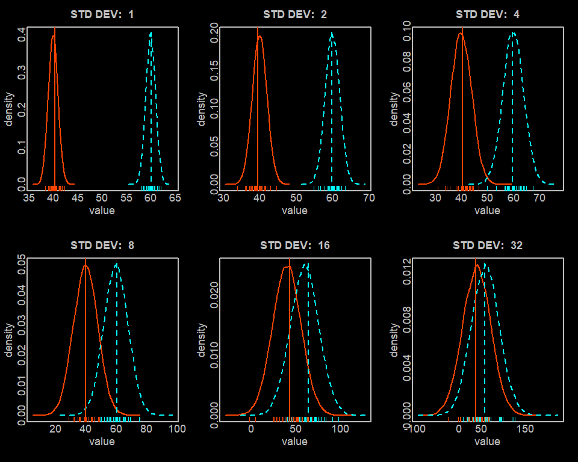
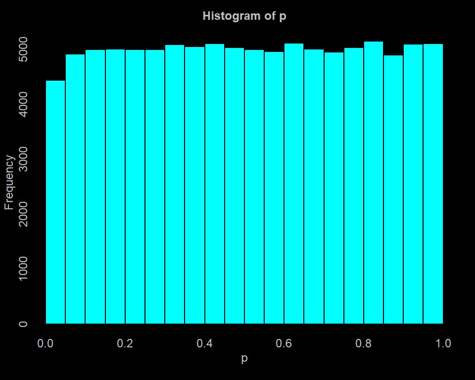

## Challenges to DE analysis

- [Home](../README.md)
- [Experimental Design](design.md)
- **[Challenges to DE analysis](challenges.md)** *(You are here)*
- [Inputs](inputs.md)
- [Check sequence quality](fastqc.md)
- [Map reads](mapping.md)
- [Generate expression matrix](count_matrix.md)
- [Import data into R](r_data.md)
- [Screen for outlier samples](outliers.md)
- [edgeR](edger.md)
- [DESeq2](deseq2.md)

---

There are a number of challenges that are intrinsic to RNA-seq data analysis. The software packages we describe later are specifically designed to deal with these issues, and the differences between packages largely arise from differences in the way these issues are addressed. 

Below we discuss the concepts of biological, technical and sampling variation. We then present some basic statistical background on how biological replication is connected to false positive and false negative rates. We explain how higher replication levels and larger group effects contribute to a higher likelihood of significant results, while higher biological and technical variation decrease the likelihood of significant results. We describe why the negative binomial distribution is often used for modeling RNA-seq data. Finally, we discuss the problem of multiplicity of testing along with the concepts of family-wise error rates and false discovery rates. If you are familiar with these concepts, you can safely skip to the [next chapter](inputs.md).

---

The simplest differential expression experiment will have two groups (say a `treated` group and a negative `control` group). We are interested in knowing which genes have expression which differs between these two groups. We typically determine this by taking each gene in turn and seeing whether its expression appears statistically different between the groups. In order to establish statistical significance in this context, we need replicates in each group. Replicates let us distinguish if the differences between groups are due to group membership, due to normal inter-individual variation between organisms (**biological variation**), or due to variation in technical procedures employed on different samples (**technical variation**). That is, if we only have one treated sample and one control sample, there is bound to be some difference between the samples due to simple biological or technical variability, and there may also be some due to group membership. We cannot distinguish the effect of group membership without an estimate of the biological and technical variability. We can estimate this variability if we have multiple biological replicates in each group. In that case, we can compare the differences of samples within groups (which represent biological and technical variability) to the mean differences between groups (which includes the effect of group membership). If the latter is large enough relative to the former, the effect of group membership will reach statistical significance.

If we look at the expression of any gene (say `geneA`) in any two control replicates (say `rep1` and `rep2`), we expect that the number of reads found to map to `geneA` can differ between replicates due to a number of factors. For instance, the amount of cDNA isolated from each sample may differ slightly (or quite a bit), the number of reads generated in the sequencing process will differ somewhat, and the sequencing quality will vary, affecting the final proportion of reads that are successfully mapped to genes. So sample `rep1` could end up having only half as many reads successfully mapped to genes as `rep2` does. We then expect signals for each gene in `rep2` to be about twice as large as those in `rep1`, creating spurious differences between the replicates. This technical variation will be addressed by **inter-sample normalization**, which aims to make the distribution of gene counts comparable between all the samples. There are several approaches to this, some of which will be described in more detail in the chapters for each software package. Most inter-sample normalization methods assume that the **majority of genes are not differentially expressed** across conditions; therefore the bulk of the signal distribution should be identical between samples when the signals are properly normalized. This idea is used to monotonically transform the signal distribution of different samples until some similarity measure between the distributions is maximized. We will discuss some specific procedures in the chapter on [outliers](outliers.md), as well as the chapters on [edgeR](edger.md) and [DESeq2](deseq2.md).

Even if every technical factor is controlled, and we get exactly the same number of reads mapped for samples `rep1` and `rep2`, we still expect there to be differences in the number of reads mapping to `geneA` between replicates. This is because `rep1` and `rep2` are biological replicates, which will reflect the differences in physiology, or biological variation, between any two organisms (even clones), resulting in sample-to-sample variations in the proportions of RNA from different genes. Even if `rep1` and `rep2` are technical replicates, rather than biological replicates (so gene expression is identical in the original split sample), and if the variation in technical procedures is eliminated, we still expect to see differences for `geneA` between the replicates. This is due to something called **sampling variation**, which is a component of technical variation.

Assume you have two identical samples, `rep1` and `rep2`, each with 1 million cDNA molecules, exactly half of which map to `geneA` and the other half of which map to `geneB`. If we were to grab/sequence exactly one cDNA molecule randomly selected from `rep1`, the probability of sequencing a `geneA` cDNA is expected to be 0.5, and the probability of sequencing a `geneB` cDNA would also be expected to be 0.5. The same is true for `rep2`. So even though the two samples are identical, if we only sequence a single cDNA molecule from each sample, the chance of sequencing the cDNA of the same gene in both sequencing reactions is only 50%. This sample-to-sample difference is the source of sampling variation. This variation occurs due to the random nature of the sampling process, and is exacerbated by our small sample size (`N=1`). As the number of cDNA molecules sampled increases, we expect the ratio of `geneA` to `geneB` cDNAs sequenced to approach 1:1 (the true 'expression ratio' for these genes) in each replicate sample. Furthermore, we will expect the observed ratio will tend to randomly vary around the 1:1 expected ratio less and less as the number of reads per replicate increases.

More realistically, we are sequencing many millions of reads from each sample, and there are on the order of 30,000 genes being expressed (in vertebrate experiments). The true range of gene expression levels in any single sample will span a large range, with some genes having tens of thousands of reads assigned, some genes having only 1 or 2 reads assigned, and other genes not having any reads assigned because their expression was too low. As we described in the previous paragraph, small numbers of reads produce less stable (tend to vary more if you repeat the experiment) estimates of the true proportion of reads belonging to different genes. This manifests in genes with lower mean counts displaying more sampling variability than those with higher mean counts. The expected distribution of the sampling variability of many types of count data is described by a [Poisson distribution](https://en.wikipedia.org/wiki/Poisson_distribution). This distribution has the property that its standard deviation is equal to the square-root of its mean. So if at a given read depth you expect to get 10 counts for `geneA` and you repeated the sampling of the same biological replicate many times at the same sequencing depth (without affecting the composition of that replicate), you would find that the average counts you get with each experiment would approach 10 and the standard deviation would approach just over 3. In this case, the standard deviation is 30% of the mean value. Similarly if you expect 100 counts, the expected standard deviation would be 10, resulting in a standard deviation only 10% of the mean. That is, the relative precision of count data improves as the counts increase.

However, the Poisson distribution only strictly applies when we are repeatedly sampling the same biological replicate without additional technical variation. If we sample different biological replicates, assuming technical variation is still zero, we will find that the variability will be larger than what the Poisson distribution suggests. This occurs due to the additional contribution of inter-individual biological variability. Under these circumstances, the Poisson distribution would underestimate the dispersion, which will tend to lead to false positives. This situation is worsened by the addition of variability due to process variations. Unlike sampling variability, which can be estimated solely based on the mean of the read counts for `geneA` (using the Poisson relationship between mean and standard deviation), the biological and technical contribution to `geneA` variation must be determined empirically from the dispersion of read counts for `geneA` across the replicates within each group. For statistical testing, we can then use the [negative binomial distribution](https://en.wikipedia.org/wiki/Negative_binomial_distribution), which depends on separate mean and dispersion parameters for its shape. The extra dispersion term allows us to capture the total of sampling variation, technical variation and biological variation. The dispersion term is then compared to the observed difference between groups in order to estimate significance. That is, the larger the difference between groups relative to the dispersion within groups the more likely a positive finding. You might get a sense of this by considering the following figure, in which we plot two groups, one with a mean of 40 and the other with a mean of 60. Samples were drawn at random from a normal distribution with the fixed mean and a varying standard deviation. This way we can see how it gets more difficult to distinguish groups with the same mean difference as the spread within each group rises. We can see that even though the difference between groups is constant (the x scale varies to accommodate the increasing variability within groups), as the spread within groups increases, the distribution of data points from each group begins to overlap, making it more difficult to distinguish the group effect from within-group variability:



The relationship between mean group differences and within group dispersions is also illustrated in a relatively simple form in the formula for the two-sample [Welch's t-test](https://en.wikipedia.org/wiki/Welch%27s_t-test), which is used to test whether there is a statistically significant difference between two groups for a single variable (like `geneA` expression level, though we usually don't use this particular test for RNA-seq data analysis). The formula for the t-statistic (the magnitude of which determines the p-value for this test) is:

```
## (abs: absolute value; sqrt: square root:
tstat = abs(mean1 - mean2) / sqrt((var1/n1) + (var2/n2))
```

where `tstat` is the t-statistic, `mean1` is the mean signal across replicates for `geneA` in group1, `mean2` is the mean signal for group2, `var1` is the variance (square of the standard deviation) of the signal across replicates in group1, `var2` is the variance in group2, `n1` is number of replicates in group1 and `n2` is number in group2. We can see that `tstat` increases with increasing differences in the means between the two groups. The formula also shows that the `tstat` decreases as either `var1` or `var2` increase (the spread/dispersion of the data within each group). The instability of estimation using small samples is reflected in `tstat` increasing with increasing `n1` and/or `n2`. The variables `mean1`, `mean2`, `var1` and `var2` are all affected by sampling variation, so `mean1` and `mean2` are expected to differ somewhat even when there really is no difference between groups. Once the t-statistic is determined, it is compared to the [t-distribution](https://en.wikipedia.org/wiki/Student%27s_t-distribution) in order to estimate the likelihood of getting such an extreme value by chance when there is not difference between groups. This comparison leads directly to the p-value output by the test. The formulas for computing the statistic for different statistical tests differs from test-to-test. So does the distribution to which the statistic is compared to calculate a p-value. Nevertheless, the relationships remain the same: the larger the true difference between group means, the smaller the within-group variability/dispersion, and the larger the replicate numbers, the more likely we are to obtain a significant p-value (lowers the **false negative rate**). 

RNA-seq experiments are expensive to conduct, and often biological samples of interest are hard to obtain. Therefore, there is always the temptation to reduce replication in order to contain costs. One problem with this is that, as we discussed in the previous paragraph, your chances of getting a truly significant result diminishes as your replication is reduced. When conducting tests on large numbers of genes, another problem that can result from low replication is a **high false-positive rate**. The variables `var11` and `var2` above are estimated from the dispersion of `geneA` signals among replicates in group1 and group2, respectively. When conducting many tests, by chance all the observations in both groups can fall close to the group's mean, resulting in an underestimate of the true variability of gene expression. This is similar to counting coin flips: we know that repeatedly flipping a fair coin should result in about half heads and about half tails. However, when you only have a few flips, getting all heads or all tails (values falling close to one another) becomes much more likely. It would not be suprising to get two or even three heads in a row, but it would be very surprising to get a hundred heads in a row. So we may often underestimate the variability in coin flip values if the number of replicate flips is small. We demonstrate this with a [Monte Carlo](https://en.wikipedia.org/wiki/Monte_Carlo_method) simulation experiment conducted in R. We repeatedly draw samples of different sizes (n=2 to n=1000) from a normally distributed population with a mean of 0 and a standard deviation of 10. We then estimate the standard deviation of the original population based on our sample. We repeat the experiment many times for every sample size, then display the summary of standard deviation estimates for each sample size:

```
## R:

set.seed(11)     ## make the pseudo-random draws reproducible

R <- 10000       ## number of experiments to conduct for each value of 'n'
tbl <- NULL      ## our output table

## n is the number of samples we will estimate standard deviation from:
##   we will try 2, 3, 5, 10, 30, 50, 100, and 1000:

for(n in c(2, 3, 5, 10, 30, 50, 100, 1000)) {   
  o <- numeric(0)                        ## collect outputs for each experiment with this value of n
  for(i in 1:R) {                        ## conduct experiments 1 through R
    x <- rnorm(n, mean=0, sd=10)         ## for experiment i, randomly draw n observations from N(0, 10)
    o <- c(o, sd(x))                     ## append the standard dev of the n observations to o
  }
  
  ## rbind() binds together rows from two tables; c() concatenates vectors:
  tbl <- rbind(tbl, c(n=n, summary(o)))  ## summary returns min, 1st quartile, median, mean, 3d quartile, max.
}
 
> round(tbl, 3)
        n  Min. 1st Qu. Median  Mean 3rd Qu.   Max.
[1,]    2 0.001   3.203  6.750 8.015  11.521 44.953
[2,]    3 0.067   5.343  8.299 8.862  11.774 34.384
[3,]    5 0.927   6.907  9.132 9.402  11.609 23.920
[4,]   10 2.548   8.076  9.586 9.706  11.218 19.779
[5,]   30 5.644   9.003  9.888 9.913  10.772 14.558
[6,]   50 6.460   9.254  9.957 9.963  10.636 14.053
[7,]  100 7.424   9.491  9.970 9.980  10.463 13.131
[8,] 1000 9.200   9.844  9.997 9.998  10.150 10.824
```

Note that the range (0.001-44.953) and interquartile range (3.203-11.521) for n=2 samples are much wider than those for n=1000 samples, reflecting that estimates of the true dispersion (standard deviation == 10) based on small sample sizes is much less reliable than when based on larger samples. Also, note for the small sample numbers the first quartile is less reliable than the third quartile -- that is underestimates are more of a problem than overestimates causing this to tend to lead to more false positives than false negatives.

When conducting an RNA-seq experiment with two groups and 5 replicates per group, testing across 30,000 genes (we only simulated 10,000 'genes' above), we should not be surprised if, for a few dozen to a few hundred genes, all ten replicates will by chance fall particularly close to their respective group means, causing the estimated dispersions to be much lower than their true values, resulting in a false-positive result. As the number of replicates goes up, the chances of such false positives decreases.

Looking for differences between two groups for each of 30,000 genes means conducting 30,000 hypothesis tests (one per gene). When working with this many hypotheses, it is worth remembering that p-values are expected to have a uniform distribution when the null hypothesis is true. That is, when there is no difference between groups (the null hypothesis is true), the likelihood of the test producing a p-value of 0.25 is the same as that for producing a 0.5, a 0.75, a 0.1, a 0.01 or a 0.001. This means that the chance of getting a p-value less than the usual cutoff of 0.05 (a significant p-value) is exactly 5% (because the interval 0 to 0.05 spans 5% of the space between the allowable range of 0 to 1 in which p-values will randomly fall) when there is no group difference. That is, a p-value of 0.05 implies that if there is no true difference and the experiment were repeated many times, only once in twenty such experiments is the result expected to be as extreme as the observed result (which happens due to chance). In other words, low p-values can happen even when there is no true difference. This also implies, that at a p-value cutoff of 0.05, if we test 100 genes for differential expression, we would expect 5 of them to be significant by chance alone (false positives). We can demonstrate this with the following Monte Carlo experiment: we will repeatedly draw two sets of 5 observations from the same population (a normal distribution with a mean of 100 and a standard deviation of 10) and use the two-sample Welch's t-test discussed earlier in this chapter to see if the groups represented by each set of observations are statistically different. Since we are drawing both sets of observations from the same population, we know there is no real difference in the two 'groups' (they are really the same group/population) and any observed difference between our sample sets represents solely sampling variation. We will count up how often we see a 'significant' (false positive) result using a p-value cutoff of 0.05:

```
## R:

R <- 100000
p <- numeric(0)

set.seed(11)

for(i in 1:R) {
  x <- rnorm(5, mean=100, sd=10)
  y <- rnorm(5, mean=100, sd=10)
  p <- c(p, t.test(x, y)$p.value)
}

> summary(p)
     Min.   1st Qu.    Median      Mean   3rd Qu.      Max. 
0.0000333 0.2568002 0.5032559 0.5039500 0.7529060 0.9999988 

> round(quantile(p, probs=c(0, 0.01, 0.05, 0.1, 0.25, 0.5, 0.75, 0.9, 0.95, 0.99, 1)), 3)
   0%    1%    5%   10%   25%   50%   75%   90%   95%   99%  100% 
0.000 0.013 0.056 0.107 0.257 0.503 0.753 0.902 0.951 0.990 1.000 

## how many false positives (anything with p-value <= cutoff)?

> table(p <= 0.05)
FALSE  TRUE 
95554  4446 

## proportion of p values <= 0.05 (pretty close to expected value of 0.05):

> sum(p <= 0.05) / R
[1] 0.04446

## plot a histogram - the frequency is more or less constant/level across the range;
##   this reflects the 'uniform' distribution of p-values under the null hypothesis:

hist(p)
```



Extrapolating to 30,000 genes, this **multiplicity of testing** issue can become a big problem: you would expect over 1000 genes to be significant (p < 0.05) by chance. This problem can most generally be addressed by controlling the **family-wise error rate** or **FWER**. The most commonly employed (and simplest) form of the FWER is the **Bonferroni adjustment**, which simply multiplies the p-value by the number of tests performed. So if you conducted tests for 30,000 genes, instead of requiring a p-value of 0.05 in order to declare significance, you would require a p-value of `0.05 / 30000` or `0.0000016`. That is, a p-value of `0.0000016` is equivalent to a Bonferroni FWER of `0.05` when there are `30000` tests. The interpretation of the FWER is the probability that any positive result is wrong. So if you have 100 genes that pass an FWER cutoff of `0.05`, there is only a 5% chance that a single gene in the entire set of positive results passes the cutoff by chance. This clean interpretation comes at the cost of substantial stringency (more chance of false negatives). 

A more relaxed (and common) approach is controlling the **false discovery rate** or **FDR**. The relaxation comes at the cost of a different interpretation: an FDR cutoff of 0.05 implies that no more than 5% of all the genes passing this threshold will be false positives. In the RNA-seq context, use of the FWER suggests a very low chance of any false positives in the result set, while the FDR suggests a very good chance of a small portion of false positives in the result set. The FDR is usually used in most genomics experiments, in part because it is more inclusive (true positives are less likely to be missed), and in part because these experiments often give so many positive results that interpretation depends on some sort of summarization based on known functional relationships (e.g. geneset analysis or pathway analysis) across the entire positive subset of genes, which is thought to be robust to the inclusion of a small proportion of false-positives. This is also the reason that, in many cases, researchers will use follow-on methods to corroborate interesting individual gene results from their FDR-based analysis. One very common, but relatively weak approach to corroboration, is using PCR on the same samples used in the RNA-seq analysis. This only controls for the effects of technical variation/error, but not for effects of biological variation in gene expression, and does not therefore constitute true independent corroboration, which requires biological samples other than those used in the initial FDR-based screen.

The most common approach to FDR calculation is the [Benjamini-Hochberg](https://www.jstor.org/stable/2346101) procedure, which is the most liberal but assumes each hypothesis (gene) is relatively independent from the others. An alternative approach, which should perform more reliably when there is a dependency between hypothesis tests, is the [Benjamini-Yekutieli](https://doi.org/10.1214/aos/1013699998). Dependencies between hypothesis tests in RNA-seq experiments can arise due to coordinate regulation of different genes. That is, if one gene is positive, other genes which are similarly regulated will tend to be positive, so tests of differential expression for these genes are not independent of one another. The details of FDR calculation are outside the scope of this tutorial, but are well described in the publications we linked to above.

The software we demonstrate for differential expression analysis below are designed to deal with the issues of technical variation (via some type of between-sample normalization algorithm), sampling variation, biological variation and multiplicity of testing. They also employ similar ideas, 'borrowing' information across genes, to attenuate dispersion estimate problems that can plague experiments conducted with small sample sizes. 

---

Next: [Inputs](inputs.md)  
Previous: [Experimental Design](design.md)  
