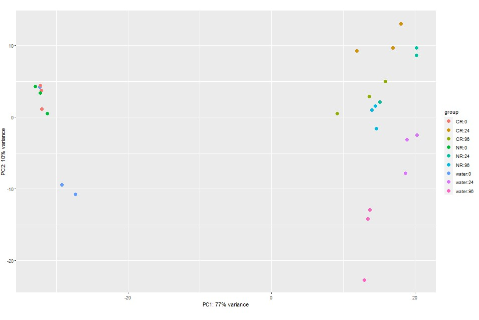
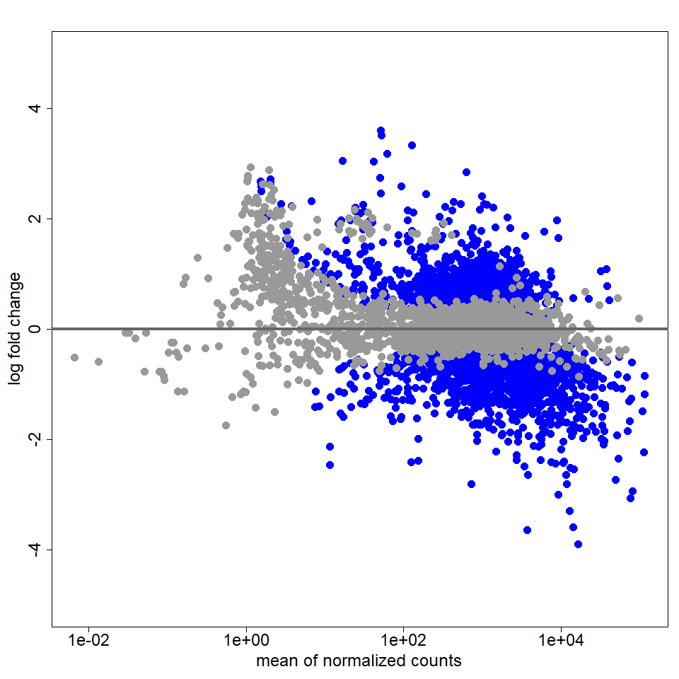

## DESeq2
 
- [Home](../README.md)
- [Experimental Design](design.md)
- [Challenges to DE analysis](challenges.md)
- [Inputs](inputs.md)
- [Check sequence quality](fastqc.md)
- [Map reads](mapping.md)
- [Generate expression matrix](count_matrix.md)
- [Import data into R](r_data.md) 
- [Screen for outlier samples](outliers.md)
- [edgeR](edger.md)
- **[DESeq2](deseq2.md)** *(You are here)*

---

### Table of contents

- [Introduction](#introduction)
- [Algorithm details](#algorithm-details)
- [Read data into R](#read-data-into-r)
- [Exploratory plot](#exploratory-plot)
- [Two-group analysis](#two-group-analysis)
- [Multivariate analysis](#multivariate-analysis)

---

### Introduction

Next, we will look for differential expression using the R package [DESeq2](https://bioconductor.org/packages/release/bioc/html/DESeq2.html). DESeq2 has its own inter-sample normalization method (**median-of-ratios method** or **MRM**), that performs similarly well to the TMM normalization used by [edgeR](edger.md) under most circumstances. Comparisons between final results produced by the two packages typically shows good overlap. The number of results returned by edgeR are sometimes higher than those produced by DESeq2, but this can vary from dataset to dataset (affected by effect sizes, replication levels, sequencing depth, etc.), and often the 'truth' is not well established, making straightforward comparisons between the packages complicated. In general, increasing biological replication and read depth should lead to greater agreement across methods.

[Table of contents](#table-of-contents)

---

### Algorithm details

You may want to read the algorithm details section of the [edgeR](edger.md) chapter before reading this chapter, as there are many similarities between the packages. We described several algorithmic approaches used by DESeq2 in more detail in that chapter which, for brevity, we do not repeat here.

The original [DESeq](https://doi.org/10.1038/npre.2010.4282.1) method introduced the MRM method for inter-sample normalization, which is based on a per-sample 'size' factor. The MRM calculation's use of a median (see below) instead of a total (the `N1` and `N2` used in the TMM formula from the algorithm section in the edgeR chapter) should make it more robust in cases where many highly expressed genes are differentially expressed (as turns out to be the case for our example yeast dataset): 

```
## size (normalization) factor for sample j is s.j;
##   gene i in sample j has k.ij counts, and there are m samples:

s.j = median.i(k.ij / (prod.v(k.iv) ^ (1 / m)))
```

Above, `median.i` is the median over genes (indexed by `i`), and `prod.v` is the product over genes, this time indexed by `v` due to the nesting of the product within the median. Here, `prod.v(k.iv) ^ (1 / m)` is the geometric mean of the counts for gene `i` across all samples. So `s.j` is the median of the gene counts in sample `j` divided by that gene's respective geometric mean values across all the samples. 

The original DESeq also incorporated the idea of using local fitting (allowing a curvilinear or flexible fit) to model the relationship between the dispersion of gene counts and the means of those genes. A similar method was incorporated into the edgeR package shortly thereafter. DESeq employs the negative binomial model for estimating p-values, as edgeR had done earlier. In part because samples are normalized directly (counts for a sample are divided by the sample's size factor) model fitting was simpler than for edgeR, but unlike edgeR, only single-factor experiments could be analyzed.

[DESeq2](https://doi.org/10.1186/s13059-014-0550-8) is the current successor of DESeq, and inherits the MRM normalization method, but adds features to calculate normalization parameters on a per-gene basis (not commonly employed, nor demonstrated in the present analysis). Normalized counts are analyzed using a generalized linear modeling framework much like edgeR, which allows a more complete range of possible relationships between variables to be examined than was possible with the original DESeq. However, the model fitting employs a simpler, more conventional maximum likelihood methodology for model fitting than used by edgeR. As part of the DESeq2 process, counts are normalized prior to model fitting instead of incorporating normalization factors within the model fitting process. Dispersions for each gene are estimated as a weighted average of a per-gene estimate and a trended estimate (as described in the algorithm section of the edgeR chapter), where the trend is determined using local regression of the variance estimated for each gene against the mean counts for that gene, resulting in a curvilinear fit. The weighting between the per-gene and trend estimate are once again based on the levels of replication and the spread of the data around the trend line, similar to the trended dispersion estimate employed by edgeR.

In addition to these features in common with edgeR, DESeq2 attempts to address another parameter estimation issue that is difficult in small samples: the fold difference in mean expression of a gene across treatments. These fold-change estimates are, like dispersion estimates, fairly unstable when replication levels are low (yet another reason for adequate replication!). DESeq2 handles the problem of overestimation of fold-change due to low replication by 'shrinking' log fold-change estimates towards zero (equivalent to no fold-change). This is like the weighted average between the gene-specific variance estimate and the trended estimate described in the previous paragraph, except one generates a weighted average of the gene-specific log fold-change estimate and zero. The weight of the gene-specific estimate increases with the increasing replication and read counts for the gene, while decreasing with increasing gene dispersion. This recalibrated difference in gene expression between treatment groups is used together with the gene's estimated dispersion to calculate a p-value and FDR.

DESeq2 uses a more complicated automated gene-filtering strategy (called [independent filtering](https://doi.org/10.1073/pnas.0914005107)) instead of the simple cutoffs used for edgeR (e.g. keep only genes with at least 10 reads in 3 samples). The DESeq2 approach to independent filtering is to filter genes based on average normalized counts so as to maximize the number of genes that pass a user-specifiable FDR cutoff.

[Table of contents](#table-of-contents)

---

### Read data into R

First we will reload our data and format it for DESeq2. The process is very similar to that used for `edgeR`, except for the final formatting function: 

```
## clean slate:

rm(list=ls())

## read in counts:

counts <- read.table("count_matrix.txt", header=T, sep="\t")

## read in sample metadata:

meta <- read.table("metadata.GSE151185.txt", header=T, sep="\t", as.is=T)
meta$time <- as.character(meta$time)
rownames(meta) <- meta$SRR

## order rows of meta like columns of x:

meta <- meta[names(counts), ] 

## how we reformat our input data for DESeq2; since just plotting, don't include interaction:

dat <- DESeq2::DESeqDataSetFromMatrix(countData=counts, colData=meta, design=~ time + treatment)

## dat is an 'S4 Class', so we need to use new syntax to list (slotNames()) 
##   and access (@) elements:

> slotNames(dat)
[1] "design"             "dispersionFunction" "rowRanges"         
[4] "colData"            "assays"             "NAMES"             
[7] "elementMetadata"    "metadata"          

## our formula; access with accessor function design():

> DESeq2::design(dat)
~time + treatment

## our metadata; can access directly w/ '@':

> head(dat@colData)
DataFrame with 6 rows and 7 columns
                 Sample         SRX         SRR       Label treatment     time       rep
            <character> <character> <character> <character>  <factor> <factor> <integer>
SRR11849386  GSM4568115  SRX8399630 SRR11849386  Waterlog_1     water       0          1
SRR11849387  GSM4568116  SRX8399631 SRR11849387  Waterlog_2     water       0          2
SRR11849388  GSM4568117  SRX8399632 SRR11849388  Waterlog_2     water       0          3
SRR11849389  GSM4568118  SRX8399606 SRR11849389   Water24_1     water       24         1
SRR11849390  GSM4568119  SRX8399607 SRR11849390   Water24_2     water       24         2
SRR11849391  GSM4568120  SRX8399608 SRR11849391   Water24_3     water       24         3

## our counts can be accessed with helper function counts():

> DESeq2::counts(dat)[1:5, 1:4]
          SRR11849386 SRR11849387 SRR11849388 SRR11849389
YAL068C             5           6           1           8
YAL067W-A           5           5           3           6
YAL067C            93          75         125         477
YAL065C            24          15          28          28
YAL064W-B          31          27          40          36
```

[Table of contents](#table-of-contents)

---

### Exploratory plot

We can now plot our samples in order to look for outliers. DESeq2 does this using PCA, which as we discussed in the [Screen for outlier samples](outliers.md) chapter, is equivalent to MDS using Euclidean distances. But first, let's reload our data and format it for DESeq2:

In order to reduce artifacts related to genes with low counts, the DESeq2 author recommends that we perform the `rlog()` [variance stabilizing transformation](https://en.wikipedia.org/wiki/Variance-stabilizing_transformation) prior to generating exploratory plots. As we mentioned when discussing the Poisson distribution, the variance of count data rises with the mean, so more highly expressed genes tend to have higher variances. The `rlog()` function attenuates this effect ('stabilizes' the variance), and performs inter-sample normalization. The function has the effect of reducing the differences between samples due to genes with small counts while leaving differences due to genes with large counts relatively unaffected:

```
x <- DESeq2::rlog(dat)

## similar to dat:

> slotNames(x)
[1] "rowRanges"       "colData"         "assays"          "NAMES"          
[5] "elementMetadata" "metadata"       

DESeq2::plotPCA(x, intgroup=c("treatment", "time"))
```



The default exploratory plot from DESeq2 is nicer than the one from edgeR, and the groupings look a lot like our homemade MDS plot from the [outliers](outliers.md) chapter.

[Table of contents](#table-of-contents)

---

### Two-group analysis

We will use the same DESeq2 functions for two-group analysis as for the other analyses, and will use the R statistical model formula notation to create model matrices as we did for the three-group and multivariate analyses conducted with edgeR. If model/design matrices are new to you, you may want to review the three-group analysis in the [edgeR](edger.md). We will generate our input data in the same way as we did for edgeR as well. We won't repeat details here:

```
x24 <- counts[, meta$time == 24]
x96 <- counts[, meta$time == 96]
x <- cbind(x24, x96)

m24 <- meta[meta$time == 24, ]
m96 <- meta[meta$time == 96, ]
m <- rbind(m24, m96)
m$time <- as.character(m$time)

> all(colnames(x) == rownames(m))
[1] TRUE

## formula just involves time variable:

des <- model.matrix(~time, data=m)

> des
            (Intercept) time96
SRR11849389           1      0
SRR11849390           1      0
SRR11849391           1      0
SRR11849398           1      0
SRR11849399           1      0
SRR11849400           1      0
SRR11849407           1      0
SRR11849408           1      0
SRR11849409           1      0
SRR11849392           1      1
SRR11849393           1      1
SRR11849394           1      1
SRR11849401           1      1
SRR11849402           1      1
SRR11849403           1      1
SRR11849410           1      1
SRR11849411           1      1
SRR11849412           1      1

dat <- DESeq2::DESeqDataSetFromMatrix(countData=x, colData=m, design=des)

## equivalent to sequentially calling:
##   estimateSizeFactors() -> estimateDispersions() -> nbinomWaldTest():

dat <- DESeq2::DESeq(dat)

## 'independent filtering' conducted by default:

res <- DESeq2::results(dat, alpha=0.05)
res <- res[order(res$padj), ]

> dim(res)
[1] 6458    6

> names(res)
[1] "baseMean"       "log2FoldChange" "lfcSE"          "stat"          
[5] "pvalue"         "padj"    

## lfcSE: standard error of log2FoldChange:

> head(res)
log2 fold change (MLE): time96 
Wald test p-value: time96 
DataFrame with 6 rows and 6 columns
         baseMean log2FoldChange     lfcSE      stat       pvalue         padj
        <numeric>      <numeric> <numeric> <numeric>    <numeric>    <numeric>
YNL134C  14411.09       -2.53839 0.1029627  -24.6535 3.37392e-134 2.13805e-130
YPL150W   2241.28        1.83061 0.0988777   18.5139  1.59556e-76  5.05553e-73
YKL091C   1027.21       -1.25973 0.0706821  -17.8224  4.73338e-71  9.99848e-68
YDR351W   1345.50        1.05875 0.0640528   16.5293  2.25851e-61  3.57805e-58
YAL060W  13525.69       -1.94104 0.1179661  -16.4542  7.82442e-61  9.91666e-58
YDR298C  15746.76       -1.61947 0.1043100  -15.5256  2.32959e-54  2.46044e-51

tbl <- data.frame(res)
tbl <- cbind(gene_id=res@rownames, tbl)

> dim(tbl)
[1] 6458    7

> head(tbl)
        gene_id  baseMean log2FoldChange      lfcSE      stat        pvalue          padj
YNL134C YNL134C 14411.089      -2.538394 0.10296274 -24.65352 3.373923e-134 2.138055e-130
YPL150W YPL150W  2241.285       1.830610 0.09887766  18.51389  1.595560e-76  5.055531e-73
YKL091C YKL091C  1027.206      -1.259726 0.07068207 -17.82243  4.733381e-71  9.998479e-68
YDR351W YDR351W  1345.498       1.058746 0.06405276  16.52927  2.258515e-61  3.578052e-58
YAL060W YAL060W 13525.691      -1.941039 0.11796613 -16.45420  7.824416e-61  9.916664e-58
YDR298C YDR298C 15746.760      -1.619470 0.10430995 -15.52556  2.329592e-54  2.460437e-51

> table(tbl$padj <= 0.05, useNA='ifany')
FALSE  TRUE  <NA> 
 2767  3570   121 

## The old edgeR 2-group result, for comparison:
## > table(tbl$FDR <= 0.05, useNA='ifany')
## FALSE  TRUE 
## 2584  3501 

DESeq2::plotMA(res, ylim=c(-5, 5))
```



The 'MA' plot above plots one point for each gene with mean normalized counts (relative expression level) on the horizontal axis, observed fold change on the vertical axis, and indicates genes with significant results(FDR below cutoff) by coloring them blue.

[Table of contents](#table-of-contents)

---

### Multivariate analysis

Finally, we will use DESeq2 to perform the same multivariate comparisons we carried out using edgeR:

```
## keep timepoints 24h and 96h; treatments CR and water:

i <- meta$time %in% c(24, 96) & meta$treatment %in% c('CR', 'water')
x <- counts[, i]
m <- meta[i, ]
m$time <- as.character(m$time)

> all(colnames(x) == rownames(m))
[1] TRUE

y <- meta[i, c('time', 'treatment')]
y$time <- as.character(y$time)
des <- model.matrix(~time + treatment + time:treatment, data=y)

> des
            (Intercept) time96 treatmentwater time96:treatmentwater
SRR11849389           1      0              1                     0
SRR11849390           1      0              1                     0
SRR11849391           1      0              1                     0
SRR11849392           1      1              1                     1
SRR11849393           1      1              1                     1
SRR11849394           1      1              1                     1
SRR11849398           1      0              0                     0
SRR11849399           1      0              0                     0
SRR11849400           1      0              0                     0
SRR11849401           1      1              0                     0
SRR11849402           1      1              0                     0
SRR11849403           1      1              0                     0

## same as for the two-group comparison example:

dat <- DESeq2::DESeqDataSetFromMatrix(countData=x, colData=m, design=des)
dat <- DESeq2::DESeq(dat)

> DESeq2::resultsNames(dat)
[1] "Intercept"             "time96"                "treatmentwater"        "time96.treatmentwater"

## time: 24h versus 96h:

res <- DESeq2::results(dat, contrast=list(c("time96")), alpha=0.05)
res <- res[order(res$padj), ]
tbl <- data.frame(res@listData)
tbl <- cbind(gene_id=res@rownames, tbl)

> head(tbl)
  gene_id  baseMean log2FoldChange     lfcSE      stat        pvalue          padj
1 YNL160W 56304.480      -3.649680 0.1031956 -35.36663 5.566203e-274 3.522850e-270
2 YML131W  6489.052      -2.310201 0.0840885 -27.47345 3.645914e-166 1.153750e-162
3 YNL134C 17434.771      -2.499771 0.1041858 -23.99339 3.259568e-127 6.876602e-124
4 YKL043W  4781.128      -2.569055 0.1074732 -23.90413 2.774318e-126 4.389664e-123
5 YHL021C  8593.257      -2.666592 0.1144784 -23.29340 5.171345e-120 6.545888e-117
6 YMR096W 11845.659       2.495163 0.1104057  22.59995 4.338451e-113 4.576343e-110

## treatment: CR vs water:

res <- DESeq2::results(dat, contrast=list(c("treatmentwater")), alpha=0.05)
res <- res[order(res$padj), ]
tbl <- data.frame(res@listData)
tbl <- cbind(gene_id=res@rownames, tbl)

> head(tbl)
  gene_id  baseMean log2FoldChange      lfcSE     stat        pvalue          padj
1 YGL006W  6387.041       1.619838 0.06686174 24.22668 1.164769e-129 7.371825e-126
2 YBR067C 15165.556       4.276283 0.17921565 23.86110 7.766344e-126 2.457660e-122
3 YFL054C  2322.519       1.883024 0.08950314 21.03864  2.906230e-98  6.131176e-95
4 YOL059W  3813.629       1.941860 0.09707178 20.00437  5.045416e-89  7.983109e-86
5 YLR064W  3195.424       2.925568 0.14705584 19.89427  4.562092e-88  5.774696e-85
6 YMR261C  3113.180       1.702664 0.08599540 19.79948  3.008110e-87  3.173054e-84

## interaction: does the response to water/CR change over time:

res <- DESeq2::results(dat, contrast=list(c("time96.treatmentwater")), alpha=0.05)
res <- res[order(res$padj), ]
tbl <- data.frame(res@listData)
tbl <- cbind(gene_id=res@rownames, tbl)

> head(tbl)
    gene_id  baseMean log2FoldChange     lfcSE      stat       pvalue         padj
1   YOR374W 23576.896      -2.431511 0.1154415 -21.06271 1.748807e-98 1.085310e-94
2   YFR047C  7119.855      -1.893996 0.0976717 -19.39145 9.112688e-84 2.827667e-80
3   YHR137W  1715.342      -3.317364 0.1761858 -18.82878 4.387793e-79 9.076882e-76
4 YNCE0017W  1424.780       2.429186 0.1332669  18.22798 3.095641e-74 4.802887e-71
5   YPR001W  5062.295      -2.786113 0.1593489 -17.48435 1.885527e-68 2.340316e-65
6   YIL057C  2482.870      -4.686450 0.2687553 -17.43761 4.275690e-68 4.422488e-65
```

[Table of contents](#table-of-contents)

---

Previous: [edgeR](edger.md)  
Home: [README](../README.md)
