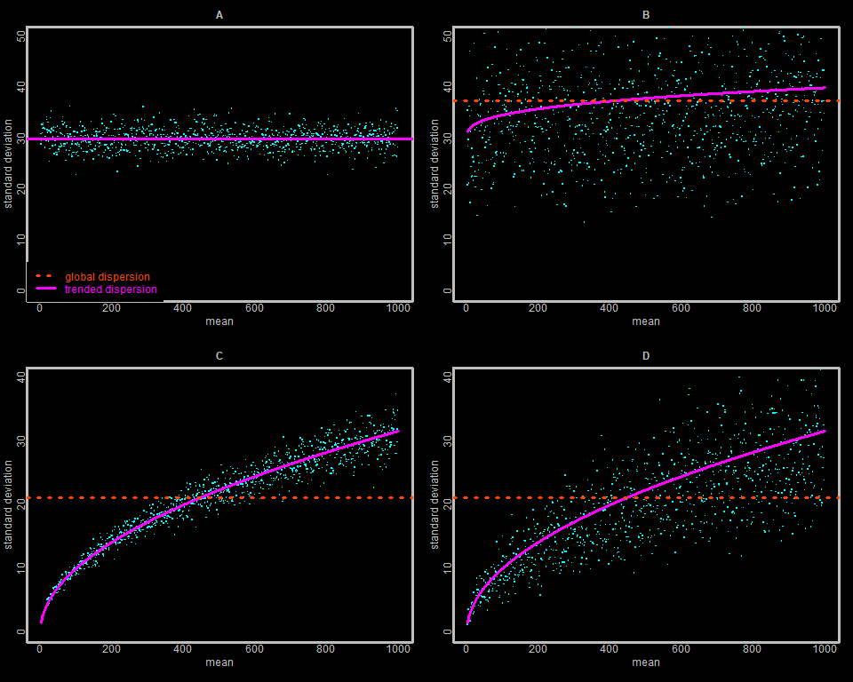
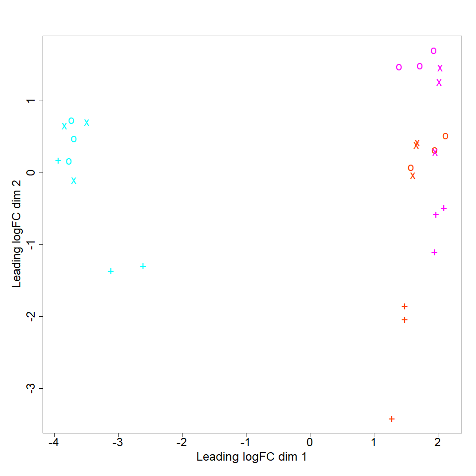

## edgeR

- [Home](../README.md)
- [Experimental Design](design.md)
- [Challenges to DE analysis](challenges.md)
- [Inputs](inputs.md)
- [Check sequence quality](fastqc.md)
- [Map reads](mapping.md)
- [Generate expression matrix](count_matrix.md)
- [Import data into R](r_data.md) 
- [Screen for outlier samples](outliers.md)
- **[edgeR](edger.md)** *(You are here)*
- [DESeq2](deseq2.md)

---

### Table of contents

- [Introduction](#introduction)
- [Algorithm details](#algorithm-details)
- [Read data into R](#read-data-into-r)
- [Exploratory plot](#exploratory-plot)
- [Two-group analysis](#two-group-analysis)
- [Three-group analysis](#three-group-analysis)
- [Multivariate analysis](#multivariate-analysis)

---

### Introduction

We will first demonstrate a differential expression analysis using the R package [edgeR](https://bioconductor.org/packages/release/bioc/html/edgeR.html). The edgeR package contains a great deal of functionality covering a wide variety of scenarios, but the basic core consists of inter-sample signal normalization, per-gene signal dispersion estimation, statistical model fitting, and FDR estimation for each gene and each biological contrast of interest.

The section below on algorithm details describes how edgeR handles many of the issues described in the [Challenges to DE analysis](challenges.md) chapter. If you are only interested in stepping through the analysis you can skip the algorithm section. However, many of the algorithm details are similar to those of used by DESeq2, and we do not repeat those details in the DESeq2 chapter. So if you are interested in the DESeq2 algorithms, you may want to read the algorithm section in this chapter first. We describe how to read the data files into R and generate an MDS plot using a function included in the edgeR package. We then show how to look for differential expression between two groups as well as various comparisons that can be made with three groups. Finally, we show how to analyze a dataset with two different variables, including how to test for an interaction between those variables.

[Table of contents](#table-of-contents)

---

### Algorithm details

The **normalization** method employed by edgeR is called **TMM** (Trimmed mean of M-values). The TMM algorithm is described in detail [here](https://doi.org/10.1186/gb-2010-11-3-r25). Like many other normalization methods, it assumes that the majority of genes are not differentially expressed across conditions. Briefly, the method first defines a gene's M-value and A-value for any pair of samples as:

```
## log2: log base 2:
M = log2((n1 / N1) / (n2 / N2))
A = 0.5 * log2((n1 / N1) * (n2 / N2))
```

where `n1` is the number of reads for this gene in the first sample, `n2` is the number of reads in the second sample, `N1` is the total number of reads across all genes in the first sample, and `N2` is the total number across genes in the second sample. So `n1 / N1` represents the proportion of all reads in sample 1 that are mapped to this gene. `M` is a preliminary estimate of fold-change in expression between samples, and `A` is a preliminary estimate of the average relative expression across both samples. For each sample, M-values are then trimmed. Trimming means sorting all the input values and removing a proportion of the most extreme values from both ends of the sorted list. This is often done to reduce effects due to outliers, but here it also serves the purpose of excluding extreme values that result from true differential expression. After trimming the M-values, a weight is calculated from the A-values for each sample:gene combination that reflects the expected variance of the corresponding M-value estimate (lower mean read counts produce noisier/less stable estimates of M, so are weighted less). Then the TMM for one sample relative to an arbitrarily selected reference sample (using this same reference sample for all the other samples) is calculated as:

```
TMM = sum_over_genes(w_g * M_g) / sum_over_genes(w_g)
```

where we sum over all the genes, `w_g` is the precision weight calculated for gene `g` (based on the A-value), and `M_g` is the M-value for gene `g`. So the TMM robustly reflects the difference in yield between this sample and the reference sample. Dividing all the expression values in this sample by the TMM, would put this sample on a more similar footing when comparing it to the reference sample. If this was repeated for all the samples, keeping the reference sample constant, differences due to technical variation are expected to be reduced, making comparisons between samples more precise. However, in the edgeR software, TMMs are not used to change the counts directly, but are included in the downstream statistical modeling steps (similar to an [offset term](https://en.wikipedia.org/wiki/Poisson_regression#%22Exposure%22_and_offset)) to achieve a similar effect.

As we discussed in the [Challenges](challenges.md) chapter, p-values depend on **dispersion estimates**, which are often poorly estimated when sample sizes are small. This problem was productively explored before the widespread adoption of RNA-seq, when a similar issue was encountered analyzing [Serial Analysis of Gene Expression](https://en.wikipedia.org/wiki/Serial_analysis_of_gene_expression) (or **SAGE**) data. Several approaches were developed, including one whose description begins [here](https://doi.org/10.1093/biostatistics/kxm030) and is extended [here](https://doi.org/10.1093/bioinformatics/btm453) in which a single **global dispersion estimate** (across samples) is made by including signals from all genes, and then for each gene a **gene-wise dispersion estimate** is made based on the observed dispersion for just that one gene. The final gene dispersion estimate for the gene is then a weighted average of the global estimate and the gene-wise estimate. The weighting depends on the levels of replication (reflecting the reliability of estimates improving with greater replication) and the variability of per-gene estimates around the global estimate (reflecting how reliably the global estimate approximates per-gene values). 

The edgeR package offers a further elaboration (similar to the DESeq2 approach) in which dispersion of genes is modeled as a continuous monotonic function of the gene's counts, called the **trended dispersion estimate**. The final gene dispersion is then estimated as a weighted average of the per-gene value and the trend-line value at the same read count as this gene's mean number of reads across samples. Originally, the dispersion trend was modeled as a linear function of the mean squared counts, but now edgeR uses local fitting, which produces a curvilinear fit of the relationship between dispersion and mean, very similar to the method introduced by the original DESeq algorithm. The relative weight of the per-gene estimate increases as replication increases, and as the average deviation of per-gene estimates around the trend line decreases. 

In the image below, we show simulated data for 1000 hypothetical 'genes' where each point represents the mean and standard deviation (gene-wise dispersion estimate) of the expression of one gene in that hypothetical scenario, the solid magenta line/curve represents the observed relationship between the mean and the standard deviation (trended dispersion estimate), and the dashed orange horizontal line represents the global (average across all genes) standard deviation (global dispersion estimate). The spread of gene-wise estimates around the trend-line is caused by the net effect of sampling variability (increases with decreasing sample size) and biologically driven gene-to-gene differences in gene expression across individuals in a population. The final gene dispersion is a weighted mean of the gene-wise dispersion estimate and one of the other two estimates (depending on how you call the software). In small sample situations, the gene-wise estimate will be unreliable/imprecise, the gene-wise estimate will be down-weighted relative to the other estimate. In panel A the standard deviation of different genes varies quite a bit, and the variation is not a function of gene expression level. Furthermore, most genes cluster relatively closely to the global estimate, suggesting the global estimate is a fairly reliable predictor of individual gene dispersion. Therefore the global estimate would get more weight. This weight increases as the spread of individual genes around the global estimate approaches the expected sampling variability. In panel B, there is a small upward trend in the relationship between a gene's standard deviation and expression level. There is also more spread in individual gene values around the trend-line. If the gene-wise estimates are based on a robust number of samples, it suggests that the trend line is not a very reliable indicator of gene dispersion, and should be weighted less. In panel C, the underlying standard deviation is equal to the square-root of the expression level (like a Poisson distribution), and it would clearly be better to use the trended dispersion estimate than the global estimate. Panel D shows the same relationship between dispersion and expression level as panel C, but the individual data points have more spread, similar to the situation in panel B. Once again, if the spread is substantially larger than the expected sampling variability, then the trended-estimate will get less weight. 



The t-test previously discussed is well suited for testing for differences between two groups (particularly when replication is robust). However, it is not naturally suited to analyzing experiments with more than two groups, to testing for interactions between conditions (such as treatment, gender, and genotype), or to analysis of conditions that are continuous instead of categorical (like treatment dose, or age). A more flexible (though technically more complex) way of conducting statistical testing, that readily accommodates all these situations is [generalized linear modeling](https://en.wikipedia.org/wiki/Generalized_linear_model). The edgeR software uses variations on [maximum likelihood](https://www.itl.nist.gov/div898/handbook/eda/section3/eda3652.htm) methods to fit the linear model to the data, with modifications to incorporate the TMM-based sample normalization factors and estimated gene dispersions. The linear model is built based on the condition variables you specify in your metadata file (the other input besides the expression matrix). Once the data is fit to the model, in the single-factor case (one condition variable which can take on 2 or more values) an [exact test](https://en.wikipedia.org/wiki/Exact_test) conceptually similar to [Fisher's exact test](https://en.wikipedia.org/wiki/Fisher%27s_exact_test) is used by edgeR to determine a p-value for each gene. In the more general multi-factor context, [likelihood ratio tests](https://en.wikipedia.org/wiki/Likelihood-ratio_test) are used to generate p-values.

[Table of contents](#table-of-contents)

---

### Read data into R

Here we review how to load the data and metadata files into R. We will describe how to format them for edgeR in the next section:

```
## read in counts:
counts <- read.table("count_matrix.txt", header=T, sep="\t")

## read in sample metadata:
meta <- read.table("metadata.GSE151185.txt", header=T, sep="\t", as.is=T)
meta$time <- as.character(meta$time)
rownames(meta) <- meta$SRR

## order rows of meta like columns of x:
meta <- meta[names(counts), ] 

> counts[1:6, 1:5]
          SRR11849386 SRR11849387 SRR11849388 SRR11849389 SRR11849390
YAL068C             5           6           1           8           4
YAL067W-A           5           5           3           6           1
YAL067C            93          75         125         477         437
YAL065C            24          15          28          28          31
YAL064W-B          31          27          40          36          36
YAL064C-A          87          55         109          98          84

> meta
                Sample        SRX         SRR      Label treatment time rep
SRR11849386 GSM4568115 SRX8399630 SRR11849386 Waterlog_1     water    0   1
SRR11849387 GSM4568116 SRX8399631 SRR11849387 Waterlog_2     water    0   2
SRR11849388 GSM4568117 SRX8399632 SRR11849388 Waterlog_2     water    0   3
SRR11849389 GSM4568118 SRX8399606 SRR11849389  Water24_1     water   24   1
SRR11849390 GSM4568119 SRX8399607 SRR11849390  Water24_2     water   24   2
SRR11849391 GSM4568120 SRX8399608 SRR11849391  Water24_3     water   24   3
SRR11849392 GSM4568121 SRX8399609 SRR11849392  Water96_1     water   96   1
SRR11849393 GSM4568122 SRX8399610 SRR11849393  Water96_2     water   96   2
SRR11849394 GSM4568123 SRX8399611 SRR11849394  Water96_3     water   96   3
SRR11849395 GSM4568124 SRX8399612 SRR11849395    CRlog_1        CR    0   1
SRR11849396 GSM4568125 SRX8399613 SRR11849396    CRlog_2        CR    0   2
SRR11849397 GSM4568126 SRX8399614 SRR11849397    CRlog_3        CR    0   3
SRR11849398 GSM4568127 SRX8399615 SRR11849398     CR24_1        CR   24   1
SRR11849399 GSM4568128 SRX8399616 SRR11849399     CR24_2        CR   24   2
SRR11849400 GSM4568129 SRX8399617 SRR11849400     CR24_3        CR   24   3
SRR11849401 GSM4568130 SRX8399618 SRR11849401     CR96_1        CR   96   1
SRR11849402 GSM4568131 SRX8399619 SRR11849402     CR96_2        CR   96   2
SRR11849403 GSM4568132 SRX8399620 SRR11849403     CR96_3        CR   96   3
SRR11849404 GSM4568133 SRX8399621 SRR11849404    Nrlog_1        NR    0   1
SRR11849405 GSM4568134 SRX8399622 SRR11849405    Nrlog_2        NR    0   2
SRR11849406 GSM4568135 SRX8399623 SRR11849406    Nrlog_3        NR    0   3
SRR11849407 GSM4568136 SRX8399624 SRR11849407     NR24_1        NR   24   1
SRR11849408 GSM4568137 SRX8399625 SRR11849408     NR24_2        NR   24   2
SRR11849409 GSM4568138 SRX8399626 SRR11849409     NR24_3        NR   24   3
SRR11849410 GSM4568139 SRX8399627 SRR11849410     NR96_1        NR   96   1
SRR11849411 GSM4568140 SRX8399628 SRR11849411     NR96_2        NR   96   2
SRR11849412 GSM4568141 SRX8399629 SRR11849412     NR96_3        NR   96   3

## distribution of variables of interest:

> table(meta$treatment, meta$time)
        0 24 96
  CR    3  3  3
  NR    3  3  3
  water 3  3  3
```

[Table of contents](#table-of-contents)

---

### Exploratory plot

Once we have our count data and corresponding sample metadata imported into R, we can use those as input for any of the analysis packages we discuss below. However, each package has its own formatting requirements for input data and helper functions to reformat input data of different types. In our case, we have a `data.frame` of counts and another with the metadata. As our first example of how to use `edgeR`, we will show how to reformat these input data, calculate inter-sample normalization factors, and then plot our samples in order to look for outliers. We will use the `DGEList()` function to reformat our data. For plotting, we will only pass in the `counts` and not a grouping variable, as the plotting function does not take advantage of that information.

```
library('edgeR')                        ## make functions available without package qualifier; we use the package qualifiers for clarity
dat <- edgeR::DGEList(counts=counts)    ## reformat input data for edgeR; counts only

## has 2 components accessible with '$' operator:

> names(dat)
[1] "counts"  "samples"

## use integer indexing to get rows 1-4 and columns 1-3 of counts:

> dat$counts[1:4, 1:3]
          SRR11849386 SRR11849387 SRR11849388
YAL068C             5           6           1
YAL067W-A           5           5           3
YAL067C            93          75         125
YAL065C            24          15          28

## note that all inter-sample normalization factors are 1:

> head(dat$samples)
            group lib.size norm.factors
SRR11849386     1 16342681            1
SRR11849387     1 17497269            1
SRR11849388     1 35838437            1
SRR11849389     1 13845100            1
SRR11849390     1 11369505            1
SRR11849391     1 18161039            1

## did not provide grouping variable, so only one group:

> table(dat$samples$group, useNA='ifany')
 1 
27 

## calculate inter-sample normalization factors:

dat <- edgeR::calcNormFactors(dat)

## does not change counts:

> dat$counts[1:4, 1:3]
          SRR11849386 SRR11849387 SRR11849388
YAL068C             5           6           1
YAL067W-A           5           5           3
YAL067C            93          75         125
YAL065C            24          15          28

## does change normalization factors:

> head(dat$samples)
            group lib.size norm.factors
SRR11849386     1 16342681    0.9881410
SRR11849387     1 17497269    1.0128920
SRR11849388     1 35838437    0.8946890
SRR11849389     1 13845100    0.8186516
SRR11849390     1 11369505    0.8365947
SRR11849391     1 18161039    0.8130239

## default plot is not so great:

plotMDS(dat, top=100)

## fancy it up: add colors for time and plotting symbols for treatment:

pchs <- c(CR='o', NR='x', water='+')[]
cols <- c('cyan', 'magenta', 'orangered')
names(cols) <- c('0', '24', '96')
pchs <- pchs[meta$treatment]
cols <- cols[meta$time]

## our plotting symbols, one per sample:

> pchs
water water water water water water water water water    CR    CR    CR    CR    CR 
  "+"   "+"   "+"   "+"   "+"   "+"   "+"   "+"   "+"   "o"   "o"   "o"   "o"   "o" 
  
   CR    CR    CR    CR    NR    NR    NR    NR    NR    NR    NR    NR    NR 
  "o"   "o"   "o"   "o"   "x"   "x"   "x"   "x"   "x"   "x"   "x"   "x"   "x" 
  
## our plotting colors:

> cols
          0           0           0          24          24          24          96 
     "cyan"      "cyan"      "cyan"   "magenta"   "magenta"   "magenta" "orangered" 
     
         96          96           0           0           0          24          24 
"orangered" "orangered"      "cyan"      "cyan"      "cyan"   "magenta"   "magenta" 

         24          96          96          96           0           0           0 
  "magenta" "orangered" "orangered" "orangered"      "cyan"      "cyan"      "cyan" 
  
         24          24          24          96          96          96 
  "magenta"   "magenta"   "magenta" "orangered" "orangered" "orangered" 

## finally, a somewhat nicer plot, which we display below:

plotMDS(dat, top=100, pch=pchs, col=cols)
```



[Table of contents](#table-of-contents)

---

### Two-group analysis

The simplest type of analysis looks for differences in gene expression between two groups (treatments/genotypes/timepoints/etc). First we will simulate a two-group dataset by splitting our data into two groups, with one group containing all the samples collected at the `24` hour timepoint, and the other group containing all the samples from the `96` hour timepoint:

```
## x will have 24h sample columns followed by 96h sample columns:

x24 <- counts[, meta$time == '24']
x96 <- counts[, meta$time == '96']
x <- cbind(x24, x96)               ## paste the columns of x24 together with those of x96

> dim(x24)
[1] 6458    9

> dim(x96)
[1] 6458    9

> dim(x)
[1] 6458   18

> x[1:5, 1:4]
          SRR11849389 SRR11849390 SRR11849391 SRR11849398
YAL068C             8           4           7           1
YAL067W-A           6           1           6           0
YAL067C           477         437         517         190
YAL065C            28          31          36          24
YAL064W-B          36          36          45          28

## group labels for edgeR:

y24 <- rep('24h', ncol(x24))
y96 <- rep('96h', ncol(x96))
y <- c(y24, y96)
rm(x24, x96, y24, y96)

> length(y)
[1] 18

> y
 [1] "24h" "24h" "24h" "24h" "24h" "24h" "24h" "24h" "24h" "96h" "96h" "96h"
[13] "96h" "96h" "96h" "96h" "96h" "96h"

> table(y)
24h 96h 
  9   9 
```

We have constructed a gene-by-sample count matrix `x`, with 6458 rows corresponding to genes and 18 columns corresponding to samples, with the first 9 samples coming from the `24h` timepoint and the last 9 samples coming from the `96h` timepoint. The timepoint labels for each sample are stored in the variable `y`, and are in register with the columns of `x`. So the second column of `x` corresponds to the second timepoint label in `y`, the third column of `x` corresponds to the third label in `y`, etc. Next, we will perform our two group analysis looking for genes whose expression differs between `0h` and `96h`. We will begin by reformatting our input data for edgeR, and then filter genes with very low expression levels:

```
## import our data into a format edgeR likes, including both counts and groups:

dat <- edgeR::DGEList(counts=x, group=y)

> dim(dat)
[1] 6458   18

## filter out genes with fewer than min.counts counts in min.samples samples; 
##   for each row/gene of x, how many samples have counts >= min.counts; if the 
##   number of samples meeting this criterion >= min.samples, i.keep is set to 
##   TRUE, else it is set to FALSE:

min.samples <- 3
min.counts <- 10
i.keep <- apply(x, 1, function(v) sum(v >= min.counts, na.rm=T) >= min.samples)

## results in filtering out only 6% of genes:

> table(i.keep, useNA='ifany')
FALSE  TRUE 
  373  6085 

dat <- dat[i.keep, , keep.lib.sizes=F]

## lost 373 rows/genes, kept 6085:

> dim(dat)
[1] 6085   18
```

In most vertebrate experiments, a much larger proportion of genes will be removed by the expression level filter we employed above. This is normal, and this filter is suitable for general use. 

Now we will calculate inter-sample normalization factors and make dispersion estimates. These are preliminary calculations required for the statistical modeling step:

```
## inter-sample normalization factors:

dat <- edgeR::calcNormFactors(dat)

> names(dat)
[1] "counts"  "samples"

## estimate dispersions:

dat <- edgeR::estimateDisp(dat)

> names(dat)
 [1] "counts"             "samples"            "common.dispersion" 
 [4] "trended.dispersion" "tagwise.dispersion" "AveLogCPM"         
 [7] "trend.method"       "prior.df"           "prior.n"           
[10] "span"              

## the 'global' estimate of dispersion; assumes common constant dispersion for all genes:

> dat$common.dispersion
[1] 0.06749597

## trended dispersion estimate; one per gene:

> head(dat$trended.dispersion)
[1] 0.25216296 0.25414641 0.04704664 0.17235737 0.15111610 0.10249719

> length(dat$trended.dispersion)
[1] 6085

## tagwise dispersion; one per gene:

> head(dat$tagwise.dispersion)
[1] 1.22340430 1.77619495 0.05394294 0.08994239 0.06072800 0.04763747

> length(dat$tagwise.dispersion)
[1] 6085
```

We are now ready to test our genes for differential expression across our two groups. For two-group analysis, the edgeR `exactTest()` function can be used. For more complicated scenarios with more groups or interactions between experimental factors or potential batch effects, we will need to use a different test function. Here we demonstrate use of `exactTest()`:

```
## conduct the actual test:

tst <- edgeR::exactTest(dat)            ## only works for 2 groups!!! 

> names(tst)
[1] "table"      "comparison" "genes"  

## not sorted, but have p-values, and logFC is log2 fold change:

> head(tst$table)
              logFC    logCPM       PValue
YAL068C   0.5485250 -1.230794 5.695757e-01
YAL067W-A 1.6397400 -1.342825 1.067578e-01
YAL067C   0.8033758  5.461451 7.699307e-07
YAL065C   0.4074084  1.743312 1.023268e-01
YAL064W-B 0.8286770  2.166138 3.246129e-05
YAL064C-A 0.4078027  3.250232 1.527879e-02   

## logFC is log2(grp1/grp2) or log2(24h/96h):

> tst$comparison
[1] "24h" "96h"

## sorted (compare to result from topTags()):

> head(tst$table[order(tst$table$PValue), ])
              logFC    logCPM       PValue
YNL134C   -2.505767 10.131573 4.811898e-79
YPL150W    1.861829  7.467647 2.203204e-62
YKL091C   -1.228393  6.326780 1.473458e-47
YOL045W    1.809528  6.257355 4.796549e-45
YAL060W   -1.909293 10.042466 9.809524e-42
YFL034C-B  1.665561  4.553074 1.274315e-41

## adds FDRs:

tst <- edgeR::topTags(tst, n=nrow(tst))

## two new list elements:

> names(tst)
[1] "table"         "adjust.method" "comparison"    "test"  

> tst$adjust.method
[1] "BH"

> tst$test
[1] "exact"

## and an added column to table:

> tst$table[1:6, ]
              logFC    logCPM       PValue          FDR
YNL134C   -2.505767 10.131573 4.811898e-79 2.928040e-75
YPL150W    1.861829  7.467647 2.203204e-62 6.703249e-59
YKL091C   -1.228393  6.326780 1.473458e-47 2.988664e-44
YOL045W    1.809528  6.257355 4.796549e-45 7.296751e-42
YAL060W   -1.909293 10.042466 9.809524e-42 1.171095e-38
YFL034C-B  1.665561  4.553074 1.274315e-41 1.171095e-38

> table(tst$table$FDR <= 0.05, useNA='ifany')
FALSE  TRUE 
 2584  3501 
```

We find plenty of positive results (n=3501), and expect only about 5% of these to be false positives (given our nominal FDR cutoff). One potential concern is that so many genes are differentially expressed that these data do not fit the assumptions behind the usual inter-sample normalization methods which we discussed in the [Challenges to DE analysis](challenges.md) chapter. This can lead to problems in assessing the direction and magnitude of changes that occur (though we can conclude that there really are many genes that are changing). Under more typical circumstances, if you had this proportion of genes differentially expressed, you should consult an experienced analyst before proceeding. If you only had 10% or fewer genes differentially expressed, you should be able to interpret the log fold-chain `logFC` column as the log base-2 of the fold-change. The fold-change is positive when gene expression is higher in the second group listed by `tst$comparison` than in the first group.  

[Table of contents](#table-of-contents)

---

### Three-group analysis

We will follow the same pattern to partition data into three groups and look for differences between any of the groups, as well as examine differences between different pairs of groups. You can extend this to an arbitrary number of groups (levels) of a single grouping variable (factor). The `exactTest()` function cannot be used in this case, so we will use `glmQLFit()` instead:

```
## set up our data:

x0 <- counts[, meta$time == 0]
x24 <- counts[, meta$time == 24]
x96 <- counts[, meta$time == 96]
x <- cbind(x0, x24, x96)

y0 <- rep('0h', ncol(x0))
y24 <- rep('24h', ncol(x24))
y96 <- rep('96h', ncol(x96))
y <- c(y0, y24, y96)
rm(x0, x24, x96, y0, y24, y96)

> table(y)
 0h 24h 96h 
  9   9   9 
  
## reformat and filter very low-expressed genes:
  
dat <- edgeR::DGEList(counts=x, group=y)
min.samples <- 3
min.counts <- 10
i.keep <- apply(x, 1, function(v) sum(v >= min.counts, na.rm=T) >= min.samples)

> table(i.keep, useNA='ifany')
FALSE  TRUE 
  360  6098 
  
dat <- dat[i.keep, , keep.lib.sizes=F]
```

Instead of using `y` directly to specify groupings, as we did in the previous two-group comparison, we will use a more complicated, but also much more flexible approach using R's statistical modeling formula notation to produce a [model matrix](https://en.wikipedia.org/wiki/Design_matrix). In addition to handling this case using one grouping variable (`time`), we can use a model matrix to handle more than one grouping variable, continuous variables, and interactions between variables. We will see some of these uses later in this chapter. In the example below, the expression `~ y` is a statistical modeling formula indicating a single, untransformed independent variable, named `y`. A model matrix is a rectangular matrix with one row for each sample (observation). Since `y` is a group (categorical) variable which can take three values (levels), the model matrix will have three columns, one for each level. One of the levels (by default, the one that comes first in an alphanumeric sort) is chosen as the **reference level**, and will always be represented by a column of ones labeled `(Intercept)`, and corresponds to an intercept value of a linear equation.  Subsequent columns will be labeled with the corresponding group/level. The non-intercept columns will have a mix of zeroes and ones, with ones indicating that the corresponding sample belongs to that group. In our case, the `0` hour timepoint is chosen as the reference/intercept column of all ones. The `24` hour timepoint is in the second column, and we can see that samples 10-18 belong to this group. The `96` hour timepoint is the third column, and samples 19-27 belong to that group. The rest of the samples (1-9) have zero in all columns except the intercept, which indicates that they belong to the `0` hour timepoint:

```
des <- model.matrix(~ y)

> des
   (Intercept) y24h y96h
1            1    0    0
2            1    0    0
3            1    0    0
4            1    0    0
5            1    0    0
6            1    0    0
7            1    0    0
8            1    0    0
9            1    0    0
10           1    1    0
11           1    1    0
12           1    1    0
13           1    1    0
14           1    1    0
15           1    1    0
16           1    1    0
17           1    1    0
18           1    1    0
19           1    0    1
20           1    0    1
21           1    0    1
22           1    0    1
23           1    0    1
24           1    0    1
25           1    0    1
26           1    0    1
27           1    0    1
```

The rest of the analysis is very reminiscent of that we used in the two group comparison, except we pass in the design matrix `des` instead of the grouping variable `y`. In order to make different comparisons, we specify different columns of the design matrix. By default, the first column (intercept) is the reference condition against which other columns are compared. In the last example, we show how to make comparisons between the last two columns (`24` and `96` hours) against one another, ignoring the intercept. More than one `logFC` column is returned by `topTags()` when more than one comparison is specified:

```
dat <- edgeR::calcNormFactors(dat)
dat <- edgeR::estimateDisp(dat, design=des)
fit <- edgeR::glmQLFit(dat, design=des)

## are there any group differences?
##   compare 0h to 24h and to 96h; returns two logFCs; 
##   FDR applies to null hypothesis that all three groups are the same;
##   if significant, you cannot statistically assert which groups are different; 
##   this corresponds to an ANOVA omnibus F-test:

tst <- edgeR::glmQLFTest(fit, coef=2:3)

> edgeR::topTags(tst)
Coefficient:  y24h y96h 
        logFC.y24h logFC.y96h    logCPM        F       PValue          FDR
YKL026C   4.370269   4.413406  7.564740 908.7426 5.080517e-27 3.098099e-23
YLR312C   5.365400   5.342584  7.914077 849.7265 1.332589e-26 4.063063e-23
YDR018C   3.539610   2.939838  5.938465 799.3221 3.203835e-26 5.016311e-23
YMR034C   3.654778   3.087732  6.819324 797.8361 3.290463e-26 5.016311e-23
YBL049W   5.742049   4.754280  8.579386 727.1729 1.242239e-25 1.276138e-22
YJR069C  -2.805227  -2.822085  5.698430 725.0791 1.294577e-25 1.276138e-22
YKL093W   4.168344   2.833065  8.170118 718.8432 1.464901e-25 1.276138e-22
YPL054W   5.959167   6.569683  8.061980 705.5861 1.911885e-25 1.457334e-22
YBR147W   4.620948   3.782441  6.827263 626.1430 1.053287e-24 7.136602e-22
YHR096C   6.536385   7.334715 10.886115 621.2737 1.177376e-24 7.179637e-22

## compare first level (0h) to second (24h):

tst <- edgeR::glmQLFTest(fit, coef=2)

> edgeR::topTags(tst)
Coefficient:  y24h 
           logFC    logCPM        F       PValue          FDR
YKL026C 4.370269  7.564740 1659.177 2.774938e-27 8.969051e-24
YLR312C 5.365400  7.914077 1595.238 4.877233e-27 8.969051e-24
YDR018C 3.539610  5.938465 1581.431 5.524956e-27 8.969051e-24
YMR034C 3.654778  6.819324 1574.517 5.883274e-27 8.969051e-24
YBL049W 5.742049  8.579386 1454.326 1.835967e-26 2.239145e-23
YKL093W 4.168344  8.170118 1414.249 2.739178e-26 2.783918e-23
YBR147W 4.620948  6.827263 1251.105 1.579849e-25 1.376274e-22
YPL054W 5.959167  8.061980 1211.319 2.505710e-25 1.909978e-22
YGL121C 4.177177  8.060556 1148.053 5.383825e-25 3.647841e-22
YLR327C 6.701868 10.351378 1137.356 6.151968e-25 3.751470e-22

## compare first level (0h) to third (96h):

tst <- edgeR::glmQLFTest(fit, coef=3)

> edgeR::topTags(tst)
Coefficient:  y96h 
           logFC    logCPM         F       PValue          FDR
YKL026C 4.413406  7.564740 1686.3328 2.198000e-27 1.340341e-23
YLR312C 5.342584  7.914077 1585.1624 5.341296e-27 1.628561e-23
YPL054W 6.569683  8.061980 1400.6706 3.144764e-26 6.392256e-23
YHR096C 7.334715 10.886115 1240.5180 1.783627e-25 2.719140e-22
YMR034C 3.087732  6.819324 1175.0144 3.867264e-25 4.716516e-22
YDR018C 2.939838  5.938465 1135.7717 6.275361e-25 6.377858e-22
YBL049W 4.754280  8.579386 1089.7444 1.130956e-24 9.852244e-22
YMR206W 5.714978  7.537070 1047.4344 1.986366e-24 1.514108e-21
YPR030W 4.464133  8.468088 1012.1416 3.232806e-24 2.190406e-21
YJR149W 2.882670  6.216889  981.2674 5.018659e-24 3.060378e-21

## compare second level to third; since neither is the 'intercept',
##   we have to set a custom contrast ignoring the first column/intercept:

tst <- edgeR::glmQLFTest(fit, contrast=c(0, -1, 1))

> edgeR::topTags(tst)
Coefficient:  -1*y24h 1*y96h 
            logFC   logCPM        F       PValue          FDR
YNL134C -2.533354 9.670237 453.5008 2.463043e-19 1.501964e-15
YPL150W  1.835906 7.047888 364.2361 4.908479e-18 1.496595e-14
YLR209C -1.272691 6.034434 283.5869 1.411429e-16 2.868965e-13
YAL060W -1.935718 9.467510 259.2820 4.616364e-16 7.037647e-13
YOL045W  1.783553 6.286875 253.9884 6.055535e-16 7.226538e-13
YMR133W -1.718969 5.395601 250.9019 7.110401e-16 7.226538e-13
YIL121W -2.371338 7.830805 247.0265 8.720929e-16 7.597175e-13
YKL091C -1.258461 6.064402 244.3311 1.006864e-15 7.674823e-13
YDR351W  1.060058 6.542506 239.8688 1.281336e-15 8.681761e-13
YEL052W -1.535515 8.034556 232.7605 1.897083e-15 1.156841e-12
```

[Table of contents](#table-of-contents)

---

### Multivariate analysis

The dataset we are using for demonstration contains two grouping variables of interest (`time` and `treatment`). Both of these variables have three levels (group labels). To make the analysis easier to demonstrate, we will reduce the dataset to include only two levels for each variable, including `24` and `96` hour timepoints and treatments `CR` and `water`. Once again we will specify a statistical formula in order to generate a model matrix. If we were just interested in the individual effects of these two variables, our formula would be `~ time + treatment`. However, we are interested in the **interaction** between these two variables as well: we have to allow for the response to be zero or near-zero at the `0` hour timepoint, and potentially grow thereafter. In order to add the interaction between two variables `var1` and `var2`, we use the notation `var1:var2`, so our formula becomes `~ time + treatment + time:treatment`. 

```
## 24h v 96h; CR v water:

i <- meta$time %in% c(24, 96) & meta$treatment %in% c('CR', 'water')
x <- counts[, i]

y <- meta[i, c('time', 'treatment')]
y$time <- as.character(y$time)
grp <- apply(y, 1, paste, collapse='_')    ## paste together columns of y w/ '_' delimiter

> grp
SRR11849389 SRR11849390 SRR11849391 SRR11849392 SRR11849393 SRR11849394 
 "24_water"  "24_water"  "24_water"  "96_water"  "96_water"  "96_water" 
 
SRR11849398 SRR11849399 SRR11849400 SRR11849401 SRR11849402 SRR11849403 
    "24_CR"     "24_CR"     "24_CR"     "96_CR"     "96_CR"     "96_CR" 

des <- model.matrix(~time + treatment + time:treatment, data=y)

> des
            (Intercept) time96 treatmentwater time96:treatmentwater
SRR11849389           1      0              1                     0
SRR11849390           1      0              1                     0
SRR11849391           1      0              1                     0
SRR11849392           1      1              1                     1
SRR11849393           1      1              1                     1
SRR11849394           1      1              1                     1
SRR11849398           1      0              0                     0
SRR11849399           1      0              0                     0
SRR11849400           1      0              0                     0
SRR11849401           1      1              0                     0
SRR11849402           1      1              0                     0
SRR11849403           1      1              0                     0
```

In the model matrix that results, the `(Intercept)` column represents our reference condition which is the `0` hour timepoint for the `CR` treatment (selected by default because it comes first alphanumerically). The second column represents the `96` hour timepoint, the third column represents the `water` treatment, and the fourth column represents the interaction between the `96` hour timepoint and `water` treatment. The first sample has a one in the first and third columns, indicating the reference `0` hour timepoint and `water` treatment. The fourth sample has ones in every column, indicating the `96` hour timepoint and `water` treatment. Sample `SRR11849398` only has a one in the first column, indicating the reference `0` hour timepoint and `CR` treatment. The last sample has ones in the first two columns, indicating that it has the `96` hour timepoint and the reference `CR` treatment. You may wonder why have a separate interaction column (the last column) when you can figure that out from the second and third columns. There are several reasons for this, but one of immediate utility is that we can specify arbitrary comparisons of interest by selecting the right columns, as we did in the three-group analysis. Choosing the last column specifically allows us to test for an interaction between our two variables. Selecting the second column allows us to look for differences across time only and selecting the third column allows us to look for differences in treatment only:

```
dat <- edgeR::DGEList(counts=x, group=grp)

## filter:

min.samples <- 3
min.counts <- 10
i.keep <- apply(x, 1, function(v) sum(v >= min.counts, na.rm=T) >= min.samples)

> table(i.keep, useNA='ifany')
FALSE  TRUE 
  373  6085 

dat <- dat[i.keep, , keep.lib.sizes=F]
dat <- edgeR::calcNormFactors(dat)
dat <- edgeR::estimateDisp(dat, design=des)
fit <- edgeR::glmQLFit(dat, design=des)

## compare 24h and to 96h; we use 'coef' parameter to specify 
##   column of interest from model matrix:

tst <- edgeR::glmQLFTest(fit, coef=2)

> edgeR::topTags(tst)
Coefficient:  time96 
              logFC    logCPM        F       PValue          FDR
YKR034W    3.603933  4.621240 700.8644 4.089413e-12 1.683336e-08
YNL160W   -3.620188 11.816723 666.2906 5.532738e-12 1.683336e-08
YML131W   -2.280105  8.700650 616.4596 8.799198e-12 1.784771e-08
YLL009C   -2.111439  6.632082 574.3524 1.341528e-11 1.930808e-08
YMR095C    1.904850  6.253689 546.6713 1.800231e-11 1.930808e-08
YMR158W   -2.036400  5.349664 537.6510 1.987573e-11 1.930808e-08
YLR308W    5.628455  3.842825 527.2113 2.233442e-11 1.930808e-08
YNCM0026C  5.010755  2.346318 512.2997 2.648818e-11 1.930808e-08
YOR306C    2.148903  6.593720 505.8554 2.855756e-11 1.930808e-08
YKL043W   -2.541078  8.263930 478.3592 3.979659e-11 2.421622e-08

## compare CR to water:

tst <- edgeR::glmQLFTest(fit, coef=3)

> edgeR::topTags(tst)
Coefficient:  treatmentwater 
           logFC   logCPM        F       PValue          FDR
YFL054C 1.882602 7.220534 479.4889 3.924339e-11 1.487110e-07
YBR067C 4.266679 9.920715 439.2811 6.595605e-11 1.487110e-07
YHR137W 2.454477 6.785292 425.0757 8.012408e-11 1.487110e-07
YLR064W 2.917256 7.678479 395.9872 1.218287e-10 1.487110e-07
YGL006W 1.613710 8.686070 394.2253 1.250795e-10 1.487110e-07
YNL336W 1.647634 5.326656 374.7674 1.686182e-10 1.487110e-07
YHL048W 1.454977 6.116796 372.8570 1.737764e-10 1.487110e-07
YOL059W 1.933580 7.936205 365.4758 1.955116e-10 1.487110e-07
YMR261C 1.695961 7.646364 356.5150 2.262937e-10 1.529997e-07
YNR034W 1.478443 6.893151 336.5202 3.177816e-10 1.680574e-07

## interaction: the change in response to water/CR over time:

tst <- edgeR::glmQLFTest(fit, coef=4)

> edgeR::topTags(tst)
Coefficient:  time96:treatmentwater 
              logFC    logCPM        F       PValue          FDR
YHR137W   -3.307786  6.785292 407.8276 1.023649e-10 5.628720e-07
YNCE0017W  2.440796  6.528594 368.6838 1.856977e-10 5.628720e-07
YPR001W   -2.779844  8.357607 340.5195 2.964614e-10 5.628720e-07
YOR347C   -2.212991  7.374793 325.6092 3.856671e-10 5.628720e-07
YIL057C   -4.681424  7.338068 315.6816 4.625078e-10 5.628720e-07
YMR303C   -4.411917  7.794941 287.7896 7.949543e-10 7.306766e-07
YOR374W   -2.423918 10.564411 285.0563 8.405483e-10 7.306766e-07
YGR260W   -2.600884  8.991286 277.0981 9.916916e-10 7.543054e-07
YFR047C   -1.888200  8.836138 267.1091 1.228502e-09 8.306041e-07
YMR158W    1.977519  5.349664 262.2779 1.366342e-09 8.314192e-07
```

[Table of contents](#table-of-contents)

---

Next: [DESeq2](deseq2.md)  
Previous: [Screen for outlier samples](outliers.md)     
