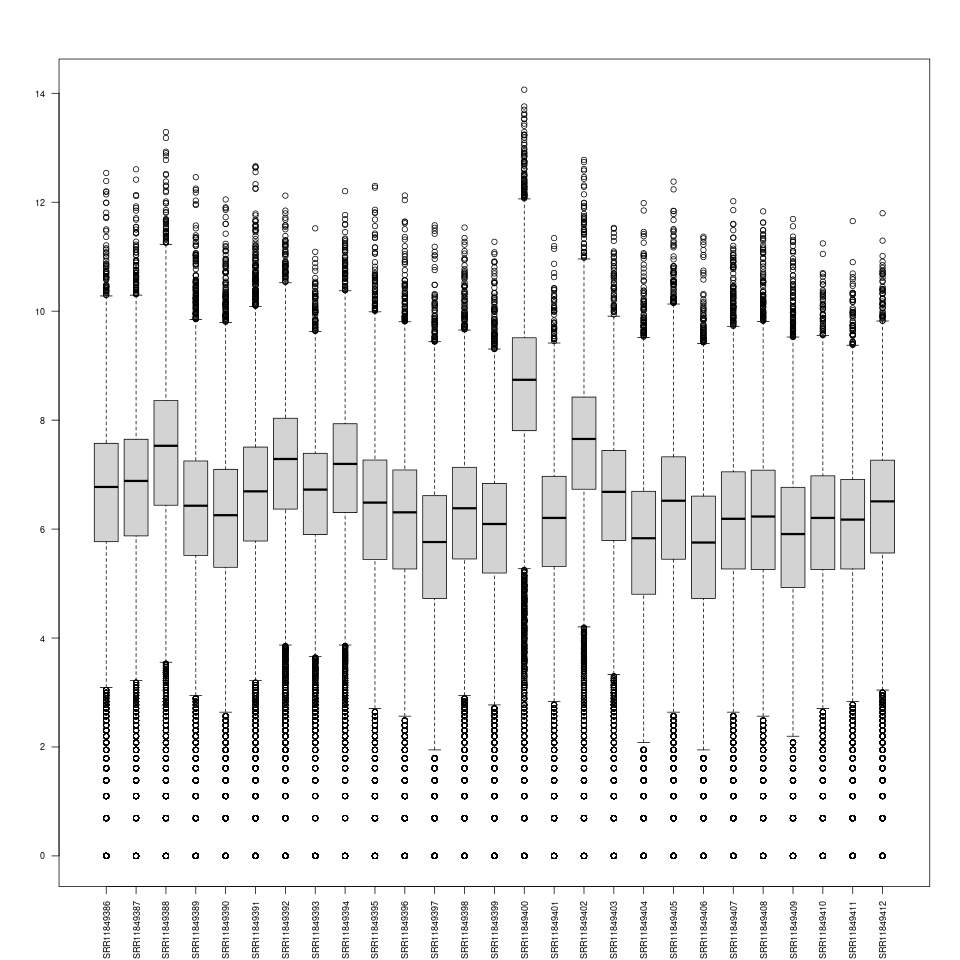
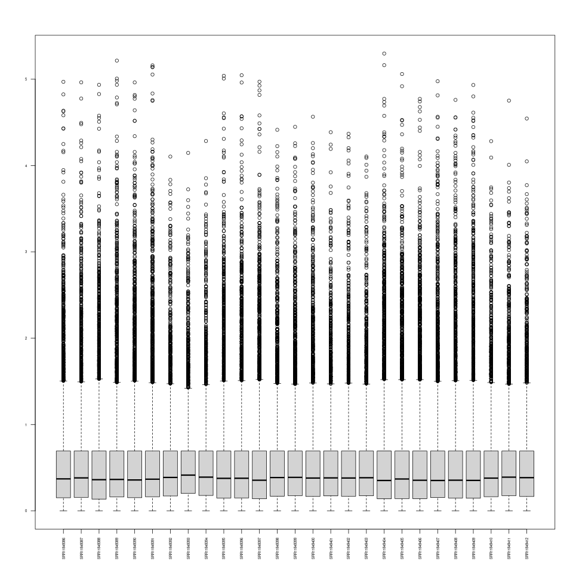
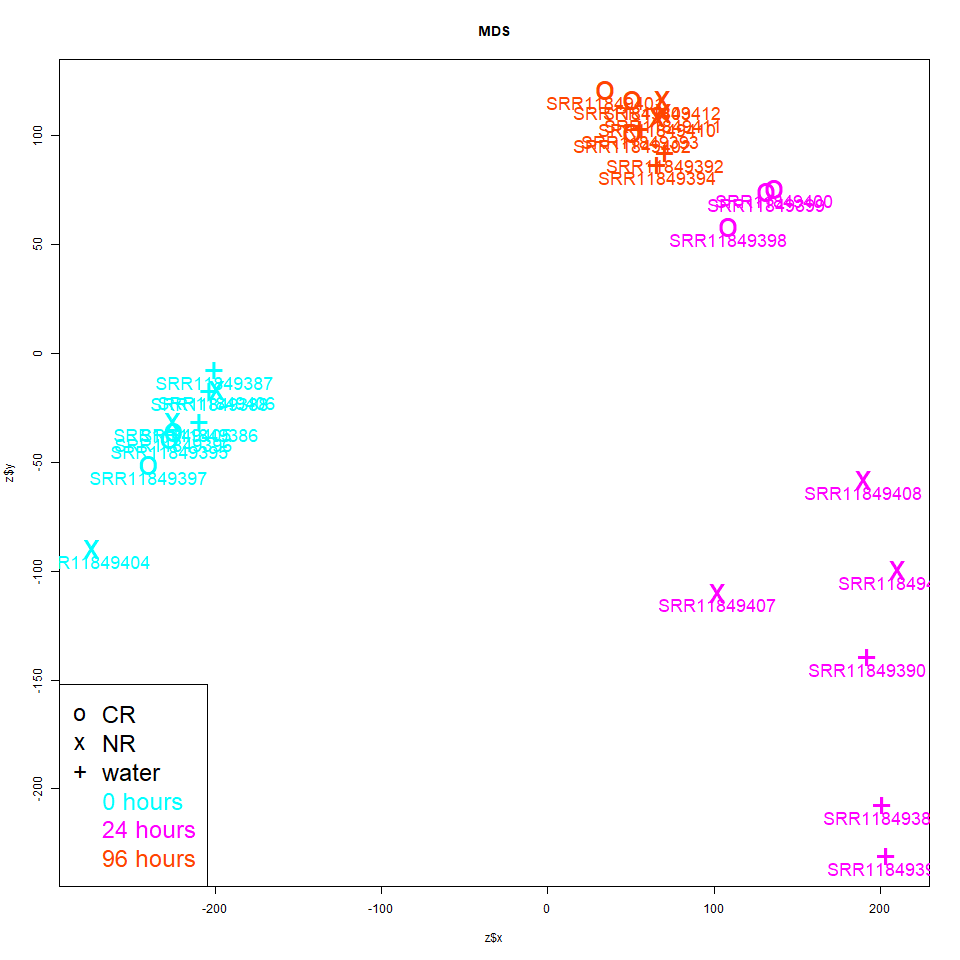

## Screening for outlier samples

- [Home](../README.md)
- [Experimental Design](design.md)
- [Challenges to DE analysis](challenges.md)
- [Inputs](inputs.md)
- [Check sequence quality](fastqc.md)
- [Map reads](mapping.md)
- [Generate expression matrix](count_matrix.md)
- [Import data into R](r_data.md) 
- **[Screen for outlier samples](outliers.md)** *(You are here)*
- [edgeR](edger.md)
- [DESeq2](deseq2.md)

---

### Table of contents

- [Introduction](#introduction)
- [Summary statistics](#summary-statistics)
- [Boxplots](#boxplots)
- [Normalization](#normalization)
- [High variance genes](#high-variance-genes)
- [Distance matrix](#distance-matrix)
- [Multidimensional scaling](#multidimensional-scaling)

---

### Introduction

Outlier samples are samples which are 'very different' from the other samples with the same group label. This difference can inflate estimates of within-group variability as well as strongly influence estimates of the group mean, potentially driving apparent differences between groups. The difference can involve the values of one or more variables (in our case, number of reads mapped to a gene). The magnitude of the difference required to judge a sample an outlier is ultimately subjective. When we note an outlier, we would like to know whether it is an outlier due to natural biological variability or due to technical factors that were not constant between samples. In most cases, samples that appear to be outliers purely due to natural biological variability should be included in the analysis, because our sample then better represents the underlying natural population and allows us to generalize the conclusions from our experiment to that population, which is usually our goal. On the other hand, if the sample is an outlier due to technical causes, it will misrepresent that natural population, and potentially lead to unreliable conclusions about that population. The distinction in the RNA-seq context can sometimes be made based on the results of our previous FASTQC analysis, which may show some sequence data files to have obvious technical artifacts. It can also be seen in unusually low numbers of uniquely mapping reads for a sample. However, sometimes we cannot clearly identify a technical cause, in which case we are unsure what to do with the sample. In this case, the best choice is usually to repeat the analysis with and without the apparent outlier and describe the differences. Results which hold up in both analyses can be judged reliable in either case. Differences in result sets should be considered with care, and you may want to consult a professional analyst.

Some rules of thumb for identifying outliers have been proposed in contexts just a few variables, such as being more than three (estimated) standard deviations from the corresponding (estimated) group mean. When working with thousands of genes, and estimating standard deviations using small sample sizes (with the problems described in the [Challenges](challenges.md) chapter), it should not be surprising if some samples have some genes which exceed this criterion. For RNA-seq experiments, the most common practice for outlier detection is visual examination of the samples plotted in two or three dimensional space. We will describe this in more detail later in this chapter. Here we will show some quick summary statistics and plots that can be used to get a general idea of differences in signal distribution between samples that likely do reflect technical artifacts, but typically are well addressed by inter-sample normalization.

Relatively easy to invoke methods for generating exploratory plots of samples for outlier detection are included in the edgeR and DESeq2 packages. The use of those plotting functions will be covered in the corresponding chapters. Here we describe basic exploration that can be performed in R, using the base packages, including a multidimensional scaling-based exploratory plot of the samples. This involves more work than using the edgeR and especially the DESeq2 packages, but may prove instructive and provides the opportunity to completely control the process. If you are not interested, you can safely skip to the [next chapter](edger.md).

[Table of contents](#table-of-contents)

---

### Summary statistics

We can restart R and navigate to our data directory. Then we can resume our work by first reloading our data:

```
## R: read in metadata and our new count matrix:

meta <- read.table("metadata.GSE151185.txt", header=T, sep="\t", as.is=T)
counts <- read.table("count_matrix.txt", header=T, sep="\t", as.is=T)
```

We can get some quick summary information for the overall signal strength (number of mapped reads) for each sample by looking at the **third quartile** of the count distribution for that sample. A somewhat less robust way to do this is to look at average expression (which is proportional to the **total expression**) across genes in each sample:

```
## sort samples by third quartile, to get a feel for the range (18x, which is big!!!;
##   2-3x more 'normal'):

> sort(apply(counts, 2, quantile, p=0.75))
SRR11849406 SRR11849397 SRR11849404 SRR11849409 SRR11849399 SRR11849411 SRR11849401
     738.00      744.00      805.50      867.75      932.00     1002.75     1062.00

SRR11849410 SRR11849407 SRR11849408 SRR11849396 SRR11849390 SRR11849398 SRR11849389
    1070.75     1152.50     1189.00     1192.50     1206.75     1253.00     1408.00

SRR11849412 SRR11849395 SRR11849405 SRR11849393 SRR11849403 SRR11849391 SRR11849386
    1428.75     1431.75     1518.00     1619.75     1706.25     1817.00     1945.75

SRR11849387 SRR11849394 SRR11849392 SRR11849388 SRR11849402 SRR11849400
    2096.50     2788.00     3085.50     4272.75     4551.25    13514.75

## or sort by total number of (uniquely mapped) reads in the sample; same story here (big range):

> sort(apply(counts, 2, sum))
SRR11849406 SRR11849397 SRR11849411 SRR11849401 SRR11849399 SRR11849410 SRR11849404
    6376777     6712267     6789650     7070585     7126399     7131917     7684067

SRR11849409 SRR11849398 SRR11849412 SRR11849393 SRR11849407 SRR11849396 SRR11849408
    8401709     9288604     9429856    10071770    10264440    10483651    11135794

SRR11849390 SRR11849403 SRR11849395 SRR11849405 SRR11849389 SRR11849386 SRR11849387
   11369505    11548162    12621037    13487088    13845100    16342681    17497269

SRR11849394 SRR11849391 SRR11849392 SRR11849402 SRR11849388 SRR11849400
   18115361    18161039    20036174    31322046    35838437   104104334
```

[Table of contents](#table-of-contents)

---

### Boxplots

More detailed information on the signal distribution within each sample can be obtained with a **boxplot**. RNA-seq signal distributions tend to be skewed, with most genes in a narrow range relatively close to zero and a few genes with orders of magnitude higher expression. This can result in plots where most of the data is clumped too closely together to be informative. In order to reduce this skew and spread the data points more evenly across the displayable range, we use the `log()` transformation. Since some counts are zero, and the log of zero is undefined (yields negative infinity in `R`), we add `1` to all the counts prior to taking the log:

```
> log(0)
[1] -Inf

> log(1)
[1] 0

boxplot(log(counts + 1), las=2, cex.axis=0.5)
```

NOTE: The above `boxplot()` call and any subsequent will not display a boxplot if you run `R` from the container. This will result in the following error (but should work fine on your laptop). This warning also goes for `plot()` or any function that intends to display a graphic in `R`.

```
Error in .External2(C_X11, d$display, d$width, d$height, d$pointsize,  :
  unable to start device X11cairo
In addition: Warning message:
In (function (display = "", width, height, pointsize, gamma, bg,  :
  unable to open connection to X11 display ''
```

This should yield a plot that looks like this:



This plot looks pretty good. We do have a bit of an outlier (sample SRR11849400), but this sample is only an outlier in the sense that it seems to have a higher read depth than the other samples, which was evident in the sum of counts and in the 75th percentile of counts. In itself, high read depth tends to be a good thing.

[Table of contents](#table-of-contents)

---

### Normalization

Differences in read depth can cause problems when they are extreme, but are usually handled reasonably well by inter-sample normalization. The type of information described in the last section provides some indication of the reproduciblity of technical processes. Larger problems are caused by outlier samples whose expression of different genes relative to one another are dramatically different than for other samples within the same group. The most common way for identifying these types of outliers is visual identification after plotting the samples in a 2 or 3 dimensional space. You can produce these plots using a number of R packages, but here we show how to do this by hand, as it gives you more control of and insight into the process, at the cost of a bit more work.

In order to control for read depth between samples, we will crudely normalize the data for each sample by dividing each gene count by the 75th percentile (a robust measure of overall non-differentially expressed gene signal intensity) of all gene counts for the corresponding sample. This method is 'quick-and-dirty' and is not recommended for normalizing data prior to testing for differential expression:

```
## inter-sample normalization: divide each signal by the 75th percentile signal
##   for that sample:

q75 <- apply(counts, 2, quantile, probs=0.75)   ## upper quartile for each sample

> head(q75)
SRR11849386 SRR11849387 SRR11849388 SRR11849389 SRR11849390 SRR11849391
    1945.75     2096.50     4272.75     1408.00     1206.75     1817.00

## normalize genes for each sample by dividing gene value in a sample
##   by corresponding samples 75th percentile expression value:

x <- apply(counts, 1, function(v) v / q75)

## note that apply() flipped our samples from columns to rows:

> x[1:4, 1:3]
                 YAL068C    YAL067W-A    YAL067C
SRR11849386 0.0025697032 0.0025697032 0.04779648
SRR11849387 0.0028619127 0.0023849273 0.03577391
SRR11849388 0.0002340413 0.0007021239 0.02925516
SRR11849389 0.0056818182 0.0042613636 0.33877841

## results in all having same upper quartile value of 1:

> apply(x, 1, quantile, p=0.75)
SRR11849386 SRR11849387 SRR11849388 SRR11849389 SRR11849390 SRR11849391
          1           1           1           1           1           1

SRR11849392 SRR11849393 SRR11849394 SRR11849395 SRR11849396 SRR11849397
          1           1           1           1           1           1

SRR11849398 SRR11849399 SRR11849400 SRR11849401 SRR11849402 SRR11849403
          1           1           1           1           1           1

SRR11849404 SRR11849405 SRR11849406 SRR11849407 SRR11849408 SRR11849409
          1           1           1           1           1           1

SRR11849410 SRR11849411 SRR11849412
          1           1           1
```

We can see the impact in the boxplot; we use `t()` to flip the table so samples are columns. This is needed because `boxplot()` makes a separate boxplot for each column:

```
boxplot(log(t(x) + 1), las=2, cex.axis=0.5)
```

The expression levels look much more even across samples now:



Use of `apply()` flipped our rows/columns so that samples, which are columns in `dat`, became rows in `x`. However, we want distances between samples. We will get those distances with the function `dist()`, which computes distances between rows; so this fortuitously works out for us. If we used `t()` to flip our matrix prior to calling `dist()`, we would get a distance matrix representing distance between genes (their similarity in expression across samples).

[Table of contents](#table-of-contents)

---

### High variance genes

We will take the top 100 genes with the highest variance of 'normalized' expression, in order to focus on genes that change quite a bit across samples. We hope this will tend to distinguish our samples from one another more effectively. These genes will tend to have high counts in at least some samples, resulting in estimates with higher precision:

```
## note that genes are now columns:
n <- 100                            ## how many genes to keep
y <- apply(x, 2, var)               ## variances of ranks each of those genes across samples

> head(y)
     YAL068C    YAL067W-A      YAL067C      YAL065C    YAL064W-B    YAL064C-A
8.644983e-06 1.201745e-05 3.079753e-02 1.192892e-04 2.348361e-04 6.278671e-04

y <- sort(y, decreasing=T)          ## highest variance genes first
y <- y[1 : n]                       ## keep results for top n genes

> head(y)
 YKL060C  YJL052W  YGR192C  YBR072W  YCR021C  YHR174W
3282.372 2798.106 2711.953 2268.777 2251.729 2033.902

idx <- names(y)                     ## get corresponding gene ids

> head(idx)
[1] "YKL060C" "YJL052W" "YGR192C" "YBR072W" "YCR021C" "YHR174W"

x <- x[, idx]                       ## use gene ids to index/subset x

> x[1:4, 1:3]
              YKL060C    YJL052W  YGR192C
SRR11849386 123.42233   9.162534 142.9911
SRR11849387 142.11591   7.537801 117.5688
SRR11849388 123.94828   4.378445 138.0855
SRR11849389  45.04972 183.068182 148.5085
```

[Table of contents](#table-of-contents)

---

### Distance matrix

We will compute the pairwise distances between rows of our matrix (which correspond to samples) using the [Euclidean distance](https://en.wikipedia.org/wiki/Euclidean_distance) metric. Another popular option is the [Manhattan distance](https://xlinux.nist.gov/dads/HTML/manhattanDistance.html) metric, which is more robust to a few outlier gene values.

```
## distance matrix; we can convert to matrix to view more easily:

d <- dist(x, method="euclidean")

## distances between samples/rows (not genes/columns):

> as.matrix(d)[1:5, 1:4]
            SRR11849386 SRR11849387 SRR11849388 SRR11849389
SRR11849386     0.00000   103.73133    61.78021    452.5289
SRR11849387   103.73133     0.00000    90.54823    456.5143
SRR11849388    61.78021    90.54823     0.00000    450.8174
SRR11849389   452.52895   456.51430   450.81742      0.0000
SRR11849390   419.46292   420.69852   416.09561     79.6080
```

[Table of contents](#table-of-contents)

---

### Multidimensional scaling

We will perform classical [multidimensional scaling](https://en.wikipedia.org/wiki/Multidimensional_scaling) or **MDS** so we can more easily visualize the relationships between samples. MDS attempts to translate the samples into a lower dimensional coordinate system, choosing that system and coordinates so as to recapitulate the distances in the input distance matrix as closely as possible (given the algorithm). We use [classical MDS](https://en.wikipedia.org/wiki/Multidimensional_scaling#Classical_multidimensional_scaling), which attempts this with a linear transformation of the original coordinate system. In our case, we will reduce the 100-dimensional (one dimension per gene, after we filtered for the 100 genes with greatest variability) space to a 2-dimensional space we can use for plotting our samples. This dimensional reduction for facilitation of plotting is reminiscent of plotting the first two principal components from a [principal component analysis](https://en.wikipedia.org/wiki/Principal_component_analysis) or **PCA**, which may be a more familiar procedure. When using the Euclidean distance metric, the MDS and PCA plots will be identical except for a possible rotation of axes (so relative distances between samples and groupings should look the same). We will now perform MDS analysis, then add some metadata that we can use for formatting our plotting symbols to distinguish the different conditions:

```
## multidimensional scaling; reduces our 100 dimensional gene space into
##   a k=2 dimensional space we can plot:

z <- cmdscale(d, k=2)
colnames(z) <- c('x', 'y')

## the columns are the coordinates of each sample in the new space:

> head(z)
                    x           y
SRR11849386 -209.4917  -31.316376
SRR11849387 -200.2761   -7.514588
SRR11849388 -203.4664  -17.261399
SRR11849389  201.1862 -207.046692
SRR11849390  191.7587 -139.386780
SRR11849391  203.2538 -230.743782

## append metadata columns we can use to indicate group membership
##   in the plots.

## To do this we will have to accommodate different column types
##   (numeric and character), so we first convert to data.frame:

z <- as.data.frame(z)

## set rownames of meta so we can index with sample id:

rownames(meta) <- meta$SRR          

> head(meta)
                Sample        SRX         SRR      Label treatment time rep
SRR11849386 GSM4568115 SRX8399630 SRR11849386 Waterlog_1     water    0   1
SRR11849387 GSM4568116 SRX8399631 SRR11849387 Waterlog_2     water    0   2
SRR11849388 GSM4568117 SRX8399632 SRR11849388 Waterlog_2     water    0   3
SRR11849389 GSM4568118 SRX8399606 SRR11849389  Water24_1     water   24   1
SRR11849390 GSM4568119 SRX8399607 SRR11849390  Water24_2     water   24   2
SRR11849391 GSM4568120 SRX8399608 SRR11849391  Water24_3     water   24   3

z$treatment <- meta[rownames(z), 'treatment']
z$time <- as.character(meta[rownames(z), 'time'])    ## convert to character index

> head(z)
                    x           y treatment time
SRR11849386 -209.4917  -31.316376     water    0
SRR11849387 -200.2761   -7.514588     water    0
SRR11849388 -203.4664  -17.261399     water    0
SRR11849389  201.1862 -207.046692     water   24
SRR11849390  191.7587 -139.386780     water   24
SRR11849391  203.2538 -230.743782     water   24

## take a look at available values for the treatment and time:

> table(z$treatment, z$time)    
        0 24 96
  CR    3  3  3
  NR    3  3  3
  water 3  3  3
```

Finally, we will do the plotting. We will start by setting up a plotting symbol vector indexable by `z$treatment` and a color vector indexable by `z$time`. Then we will use the `plot()` function to plot the symbols, followed by the `text()` function to label the symbols with the sample identifiers. The color vector is used to set the color of both the symbols and sample identifiers:

```
## set up plotting symbols:

pchs <- c(CR='o', NR='x', water='+')
cols <- c('cyan', 'magenta', 'orangered')
names(cols) <- c('0', '24', '96')

> pchs
 CR    NR water
"o"   "x"   "+"

> cols
     0          24          96
"cyan"   "magenta" "orangered"

## plot the formatted data points:
plot(x=z$x, y=z$y, pch=pchs[z$treatment], col=cols[z$time], main='MDS', cex=1)

## labels below (pos=1) point, with size controlled by cex:
text(x=z$x, y=z$y, labels=rownames(z), cex=0.5, pos=1, col=cols[z$time])

## add a legend (optional):

> names(cols)
[1] "0"  "24" "96"

> paste(names(cols), 'hours')
[1] "0 hours"  "24 hours" "96 hours"

legend(
  'bottomleft',
  legend=c(names(pchs), paste(names(cols), 'hours')),
  col='black',
  text.col=c(rep('black', 3), cols),
  pch=c(pchs, rep(NA, 3)),
  cex=0.75
)
```

This should result in a plot similar to the following:



We are happy to see that the samples do seem to clump by color:symbol combination (combination of treatment:time), which suggests we have a good chance of finding differentially expressed genes. The absence of this should not deter you from continuing with your analysis though -- this just suggests that, in this case, many highly expressed genes differ between the treatment groups. The groupings are fairly tight/distinct, and we don't see any particularly bad outliers from their respective groups. So we don't see anything in this plot that would lead us to exclude specific samples from our analysis. If you do find a troubling outlier sample, you should first check your FASTQC outputs and unique mapping rates to see if you can identify a technical cause. If you can find a clear technical cause, you can usually safely delete the outlier sample from your analysis. If no technical cause can be found, you should consider repeating your analysis with and without this sample and describing the sensitivity of your results to the inclusion of the sample. A strong effect of `time` is evident, regardless of `treatment`.

[Table of contents](#table-of-contents)

---

Next: [edgeR](edger.md)  
Previous: [Import data into R](r_data.md)   
